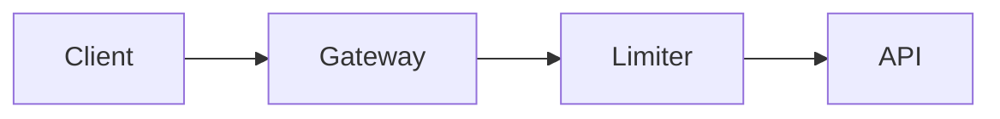

# VisualPlan

Render an AI agent's implementation and design plans as polished, visual web pages instead of
walls of text. A plan is written as MDX and compiled to a single self-contained HTML page with
architecture diagrams, charts, file-change trees, option comparisons, callouts, and a numbered
phase timeline.

It comes in two parts that work together:

- **`vplan`** is a CLI that renders a plan `.mdx` file to HTML.
- **`visual-plan`** is an agent skill that teaches any AI agent (Claude Code, Cursor, Codex,
  and others) the plan vocabulary, so it writes visual plans instead of prose.

## Install

### The agent skill

Installs the `visual-plan` skill into your coding agent so it authors plans visually:

```bash
npx skills add brandonburrus/visualplan
```

### The CLI

The skill renders plans with `vplan`, so install it too (the skill will prompt for this if it
is missing):

```bash
npm i -g vplan
# or run without installing:
npx vplan plan.mdx
```

## Usage

```bash
vplan plan.mdx           # render to plan.plan.html and open it
vplan plan.mdx --watch   # live-reloading dev server while you edit
vplan check plan.mdx     # validate a plan without rendering it
vplan components         # print the component vocabulary
```

A plan is an MDX file that starts with a `# Title` (no frontmatter) and uses a fixed set of
components, always in scope (no imports):

````mdx
# Add rate limiting to the API

We add a sliding-window limiter at the gateway, behind a flag.



<Phase title="Build the limiter" status="active">
  Implement the Redis-backed window and return 429 over the limit.
</Phase>

<Callout type="risk">
  A Redis outage must fail open, not closed.
</Callout>
````

The full vocabulary: `Phase` (timeline steps), ` ```mermaid ` (flowchart, sequence, state,
class, ER, and XY diagrams), `FileTree` (file-change maps), `Chart` (bar/line/pie), `Compare`
(option tradeoffs), `Callout` (note/decision/risk/warn), `Questions`, `Checklist`, and
syntax-highlighted code blocks with file titles. Run `vplan components` for the exact props.

## License

MIT
