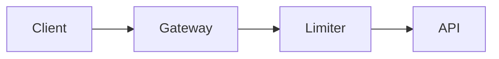

<p align="center">
  
</p>

Turn an AI agent's implementation and design plans into polished, visual web pages instead of
walls of text. A plan is written as MDX and compiled to a single self-contained HTML page:
architecture diagrams, charts, metric cards, file-change trees, option comparisons, callouts,
math, and a numbered phase timeline.

**Documentation and live examples: [visualplan.dev](https://visualplan.dev)**

It comes in two parts that work together:

- **`vplan`** is a CLI that renders a plan `.mdx` file to a single self-contained HTML page.
- **`visual-plan`** is an agent skill that teaches any AI agent (Claude Code, Cursor, Codex, and
  others) the plan vocabulary, so it writes visual plans instead of prose.

## Install

### The Skill

Installs the `visual-plan` skill into your coding agent so it authors plans visually:

```bash
npx skills add brandonburrus/visualplan
```

### The CLI

The skill renders plans with `vplan`, so install it too (the skill prompts for this if it is
missing):

```bash
npm i -g vplan
# or run without installing:
npx vplan plan.mdx
```

## Usage

```bash
vplan plan.mdx              # render to plan.plan.html and open it
vplan plan.mdx --watch      # live-reloading dev server while you edit
vplan plan.mdx --review     # interactive review session, blocks for sign-off
vplan check plan.mdx        # validate a plan (syntax + quality lint) without rendering
vplan export pdf plan.mdx   # render to a static PDF or JPG via headless Chromium
vplan share plan.mdx        # print a shareable visualplan.dev link
vplan components            # print the component vocabulary
vplan config                # view or change persistent settings (default theme)
```

A plan is an MDX file that starts with a `# Title` (no frontmatter) and uses a fixed set of
components, always in scope (no imports):

### Example Plan

````mdx
# Add rate limiting to the API

We add a sliding-window limiter at the gateway, behind a flag.



<Phase title="Build the limiter" status="active">
  Implement the Redis-backed window and return 429 over the limit.
</Phase>

<Callout type="risk">
  A Redis outage must fail open, not closed.
</Callout>
````

### All components

 - ` ```mermaid ` (flowchart, sequence, state, class, ER, and XY diagrams)
 - ` ```math ` (LaTeX, typeset as MathML)
 - `Phase` (timeline/execution/planning steps)
 - `FileTree` (file-change maps)
 - `Chart` (bar, line, area, scatter, radar, gauge, funnel, treemap, and pie graphs, with optional stacking)
 - `Stat` (headline metric cards)
 - `Compare` (option tradeoffs)
 - `Matrix` (scorecards)
 - `Callout` (note/tip/risk/decision/warning)
 - `Questions`
 - `Checklist`
 - syntax-highlighted code blocks with file titles

## Share a plan

Every rendered plan has a share button that copies a link encoding the entire plan. The plan
is base64url encoded into a query param where it is securely decompressed into a sandboxed iframe
in the browser at [visualplan.dev](https://visualplan.dev). This means you can share a plan with
anyone simply by sharing the URL, without having to send files or make any kind of account. Run
`vplan share plan.mdx` to print the same link from the CLI without rendering first.

## Documentation

Full docs, guides, and rendered examples live at [visualplan.dev](https://visualplan.dev).
