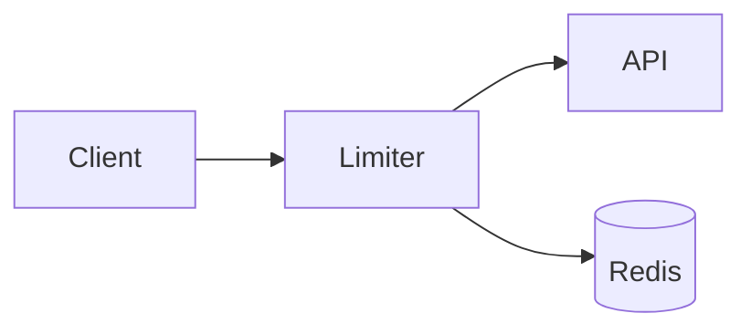

# Add rate limiting to the API

Count requests per API key in a sliding window and return `429` over budget, so one
noisy client can't starve database connections for everyone else.

<Compare>
## Redis sliding window (pick)
- pro: accurate across all nodes
- con: one network hop per request

## In-memory token bucket
- pro: zero network latency
- con: per-node only, resets on deploy
</Compare>

<Chart type="bar" title="Effort (days)">
- Limiter: 2
- Dashboards: 1
- Rollout: 1
</Chart>

<Callout type="risk">
If Redis is unreachable, fail open with a loud alert: availability outranks throttling.
</Callout>
