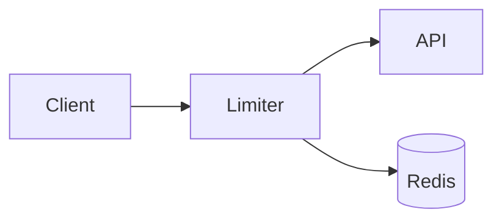

# Add rate limiting to the API

Add a gateway middleware that counts requests per API key in a sliding window and
returns `429` with a `Retry-After` header once a client is over its budget.

<Phase title="Implement the middleware" status="active">
Derive the key from the authenticated API key, run the sliding-window script, and
short-circuit with 429 when the client is over budget.
</Phase>

<Questions>
- Should the limiter fail open or fail closed if Redis is unreachable?
- Is a per-key budget of 100 requests per minute the right default?
</Questions>

<Callout type="risk">
If Redis is unreachable the middleware must pick a policy. We fail open with a loud
alert: availability outranks throttling for our traffic profile.
</Callout>
