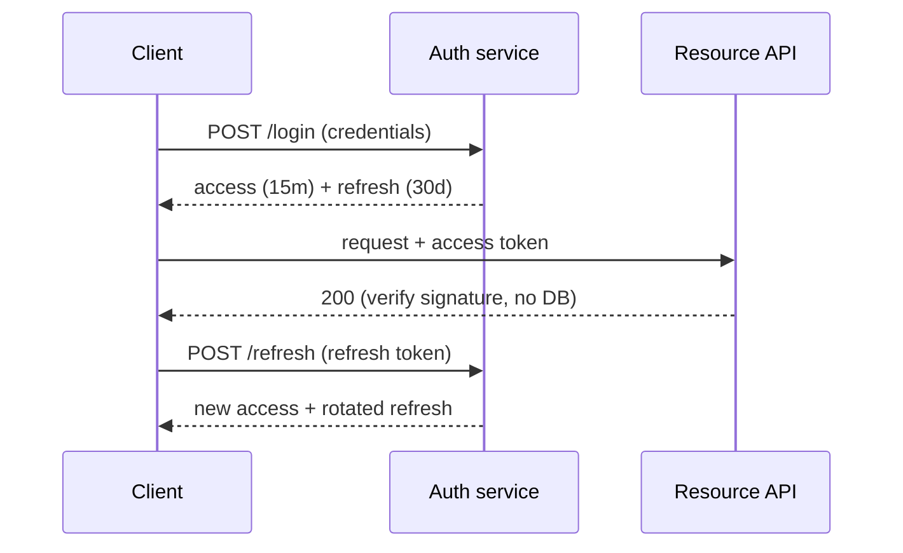

# Migrate auth from server sessions to JWT

We are replacing server-side session storage with stateless JWT access tokens plus
rotating refresh tokens. The goal is to drop the session store as a scaling
bottleneck and a single point of failure, while keeping logout and revocation working.

<Callout type='decision'>
  Access tokens are short-lived (15 min) and never stored server-side. Revocation is
  handled by a refresh-token denylist keyed on a token id, so logout stays instant
  without reintroducing per-request session reads.
</Callout>

## Token flow

## Approach

<Compare
  options={[
    { name: 'JWT + refresh denylist', pros: ['stateless reads', 'instant revocation'], cons: ['denylist to maintain'], pick: true },
    { name: 'Opaque token + Redis lookup', pros: ['trivial revocation'], cons: ['a DB read per request', 'keeps the bottleneck'] },
  ]}
/>

<Phase title='Issue and verify tokens' status='active'>
  1. Sign access tokens with a rotating key set (JWKS), 15-minute expiry.
  2. Add middleware that verifies the signature and claims with no datastore read.

  <FileTree
    files={[
      { path: 'src/auth/jwt.ts', change: 'add' },
      { path: 'src/auth/jwks.ts', change: 'add' },
      { path: 'src/middleware/authenticate.ts', change: 'modify' },
      { path: 'src/session/store.ts', change: 'delete' },
    ]}
  />
</Phase>

<Phase title='Refresh and revocation' status='planned'>
  Rotate the refresh token on every use and denylist the prior id. Logout adds the
  current id to the denylist (TTL = refresh lifetime).

  <FileTree
    files={[
      { path: 'src/auth/refresh.ts', change: 'add' },
      { path: 'src/auth/denylist.ts', change: 'add' },
      { path: 'src/routes/logout.ts', change: 'modify' },
    ]}
  />
</Phase>

<Phase title='Cut over and remove sessions' status='planned'>
  Dual-read sessions and JWTs during rollout, then delete the session store.

  <Chart
    type='bar'
    title='Estimated effort (days)'
    data={[
      { label: 'Issue/verify', value: 3 },
      { label: 'Refresh/revoke', value: 2 },
      { label: 'Dual-read', value: 2 },
      { label: 'Teardown', value: 1 },
    ]}
  />
</Phase>

<Callout type='risk'>
  A leaked signing key forges any identity. Keys must live in the KMS, rotate on a
  schedule, and the verifier must honor JWKS rotation without a redeploy.
</Callout>

<Callout type='warn'>
  Do not delete the session store until dual-read has run clean for a full refresh
  lifetime (30 days), or in-flight sessions break on cutover.
</Callout>
