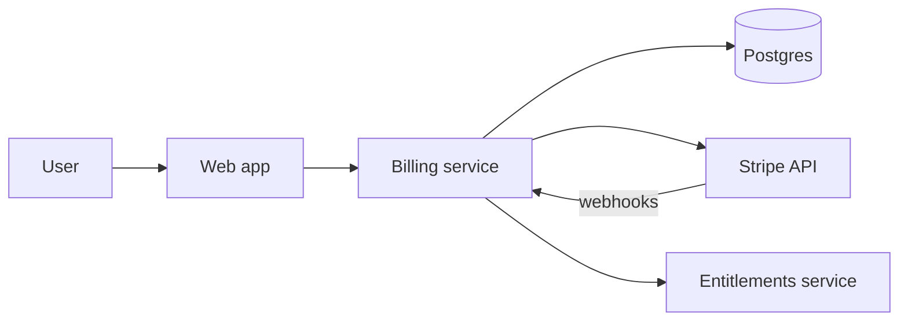
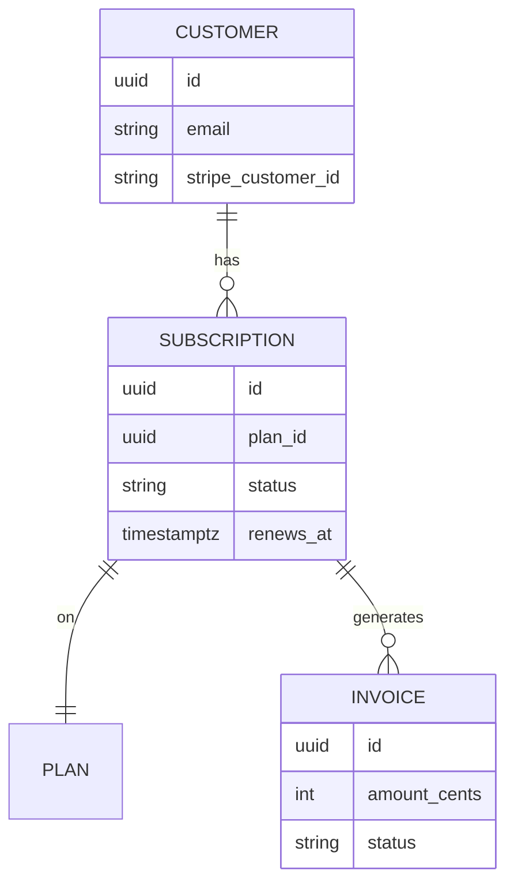
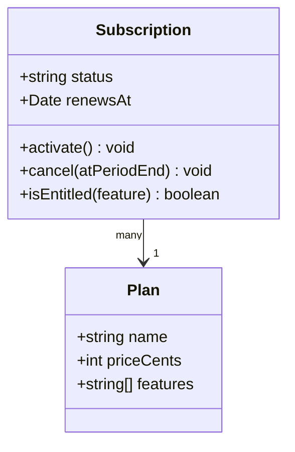
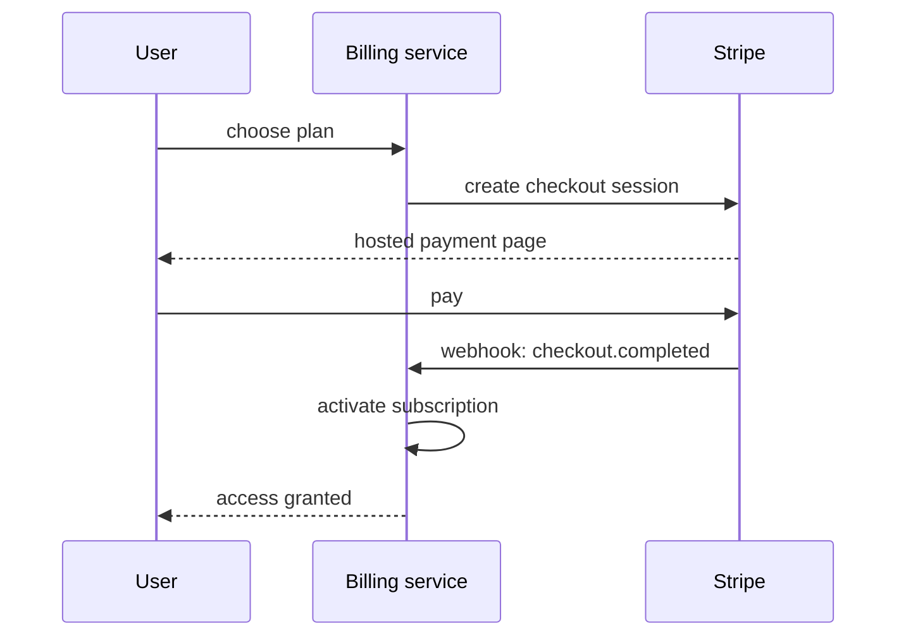
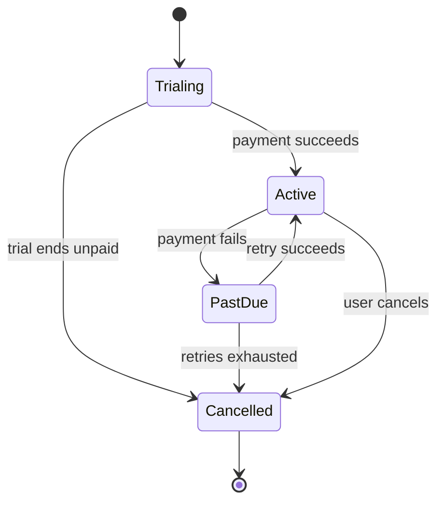

# Launch a self-serve billing platform

We are replacing the manual, invoice-by-email billing process with a self-serve
platform: customers pick a plan, pay by card, and manage their own subscription.
This plan covers the data model, the payment flow, and a staged rollout behind a flag.

<Callout type='decision'>
  We use Stripe for card processing and store our own subscription state, rather than
  treating Stripe as the source of truth. Keeping the lifecycle in our database means
  entitlements do not depend on a third-party webhook arriving on time.
</Callout>

## System architecture



## Data model



## Domain model



## Checkout flow



## Subscription lifecycle



## Approach

<Compare
  options={[
    { name: 'Stripe Billing + our state', pros: ['PCI handled by Stripe', 'own the entitlement logic', 'fast to ship'], cons: ['webhook reconciliation'], pick: true },
    { name: 'Build full billing in-house', pros: ['no vendor'], cons: ['PCI scope', 'months of work', 'dunning from scratch'] },
  ]}
/>

<Callout type='note'>
  Entitlement checks read only our database, never Stripe at request time. Stripe state
  flows in through webhooks and a nightly reconciliation job, so a slow webhook never
  blocks a user.
</Callout>

The lifecycle transition is a pure function over the current state and the event:

```ts title="src/billing/lifecycle.ts"
function next(state: SubStatus, event: BillingEvent): SubStatus {
  switch (event.type) {
    case 'payment_succeeded':
      return 'active'
    case 'payment_failed':
      return state === 'past_due' ? 'cancelled' : 'past_due'
    case 'user_cancelled':
      return 'cancelled'
    default:
      return state
  }
}
```

<Phase title='Schema and Stripe wiring' status='done'>
  Stand up the tables and connect the Stripe account in test mode.

  ```sql title="migrations/001_billing.sql"
  create table subscription (
    id uuid primary key default gen_random_uuid(),
    customer_id uuid not null references customer(id),
    plan_id uuid not null references plan(id),
    status text not null default 'trialing',
    renews_at timestamptz
  );
  ```

  <FileTree
    files={[
      { path: 'migrations/001_billing.sql', change: 'add' },
      { path: 'src/billing/stripe-client.ts', change: 'add' },
      { path: 'src/config/env.ts', change: 'modify' },
    ]}
  />
</Phase>

<Phase title='Checkout and webhooks' status='active'>
  1. Create checkout sessions and handle the completion webhook.
  2. Reconcile subscription state from Stripe events.

  <FileTree
    files={[
      { path: 'src/billing/checkout.ts', change: 'add' },
      { path: 'src/billing/webhooks.ts', change: 'add' },
      { path: 'src/billing/lifecycle.ts', change: 'add' },
      { path: 'src/legacy/manual-invoice.ts', change: 'move' },
    ]}
  />
</Phase>

<Phase title='Self-serve portal and rollout' status='planned'>
  Ship the plan picker and the manage-subscription page, then ramp behind a flag.

  ```bash title="scripts/enable-billing.sh"
  flagctl set billing.self_serve --rollout 5% --cohort beta
  ```

  <FileTree
    files={[
      { path: 'apps/web/billing/plans.tsx', change: 'add' },
      { path: 'apps/web/billing/manage.tsx', change: 'add' },
      { path: 'src/legacy/manual-invoice.ts', change: 'delete' },
    ]}
  />
</Phase>

## Effort and projections

<Chart
  type='bar'
  title='Estimated effort (days)'
  data={[
    { label: 'Schema', value: 2 },
    { label: 'Checkout', value: 4 },
    { label: 'Webhooks', value: 3 },
    { label: 'Portal', value: 4 },
  ]}
/>

<Chart
  type='line'
  title='Projected MRR after launch (thousands)'
  data={[
    { label: 'M1', value: 8 },
    { label: 'M2', value: 14 },
    { label: 'M3', value: 23 },
    { label: 'M4', value: 35 },
    { label: 'M5', value: 50 },
  ]}
/>

<Chart
  type='pie'
  title='Expected plan mix'
  data={[
    { label: 'Starter', value: 55 },
    { label: 'Pro', value: 35 },
    { label: 'Enterprise', value: 10 },
  ]}
/>

<Questions
  items={[
    'Do we offer a trial without a card up front, or require a card to start the trial?',
    'How many dunning retries before we cancel, and over what window?',
    'Should annual plans be in scope for launch, or monthly only to start?',
  ]}
/>

## Definition of done

<Checklist
  title='Launch when'
  items={[
    { text: 'Checkout creates a live subscription end to end', done: true },
    { text: 'Webhooks reconcile state within 5 minutes', done: true },
    { text: 'Self-serve cancel and plan change work', done: false },
    { text: 'Dunning retries and final cancellation verified', done: false },
    { text: 'Reconciliation alert fires on webhook age > 5m', done: false },
  ]}
/>

<Callout type='risk'>
  If a webhook is missed and reconciliation lags, a paying customer could briefly lose
  access. Reconcile on read for active subscriptions, and alert on webhook age over 5 minutes.
</Callout>

<Callout type='warn'>
  Test-mode and live-mode Stripe keys must never cross environments. A live key in
  staging will charge real cards. Gate keys by environment and fail closed if unset.
</Callout>
