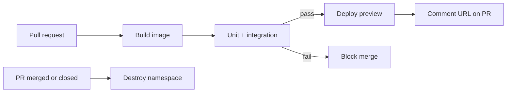
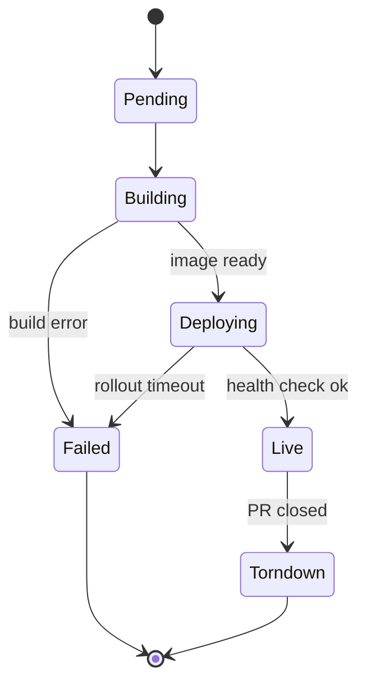

# Add preview environments to CI/CD

Reviewers cannot see a change running until it merges, so visual bugs slip through.
We are adding a per-pull-request preview environment: every PR gets an isolated
deploy at a stable URL, torn down when the PR closes.

<Callout type='decision'>
  Previews deploy to the existing staging cluster under a per-PR namespace, not a new
  account. Reusing the cluster keeps cost and IAM surface flat; isolation is by
  namespace and a unique hostname.
</Callout>

## Pipeline



## Deploy states



## Approach

<Compare
  options={[
    { name: 'Namespace per PR on staging', pros: ['cheap', 'reuses cluster + secrets', 'fast spin-up'], cons: ['shared node capacity'], pick: true },
    { name: 'Ephemeral cluster per PR', pros: ['full isolation'], cons: ['slow', 'costly', 'IAM sprawl'] },
  ]}
/>

The workflow triggers on pull request events:

```yaml title=".github/workflows/preview.yml"
on:
  pull_request:
    types: [opened, synchronize, reopened, closed]

jobs:
  preview:
    runs-on: ubuntu-latest
    steps:
      - uses: actions/checkout@v4
      - run: ./scripts/deploy-preview.sh "pr-${{ github.event.number }}"
```

Teardown is a single idempotent call:

```bash title="scripts/teardown-preview.sh"
kubectl delete namespace "pr-${PR_NUMBER}" --ignore-not-found
```

<Phase title='Build and publish per-PR images' status='active'>
  Tag images with the PR number and push to the registry.

  <FileTree
    files={[
      { path: '.github/workflows/preview.yml', change: 'add' },
      { path: 'scripts/deploy-preview.sh', change: 'add' },
      { path: 'scripts/build-image.sh', change: 'modify' },
    ]}
  />
</Phase>

<Phase title='Deploy, comment, and tear down' status='planned'>
  Apply the namespaced manifests, post the URL, and clean up on close.

  <FileTree
    files={[
      { path: 'deploy/preview/namespace.yaml', change: 'add' },
      { path: 'deploy/preview/ingress.yaml', change: 'add' },
      { path: 'scripts/teardown-preview.sh', change: 'add' },
    ]}
  />
</Phase>

## Where the time goes

<Chart
  type='bar'
  title='Pipeline stage duration (seconds)'
  data={[
    { label: 'Build', value: 95 },
    { label: 'Test', value: 140 },
    { label: 'Deploy', value: 35 },
    { label: 'Health', value: 20 },
  ]}
/>

<Questions
  items={[
    'Do previews need seeded data, or is an empty database acceptable for review?',
    'Should we cap concurrent previews to protect staging capacity, and at what number?',
    'Who owns secrets for previews: the shared staging set, or per-PR scoped tokens?',
  ]}
/>

<Callout type='warn'>
  Forks do not get secrets in CI, so preview deploys from forked PRs will fail. Gate
  the deploy on same-repo branches and say so in the PR comment.
</Callout>

<Callout type='risk'>
  A leaked teardown (PR closed event missed) leaves namespaces running and consuming
  capacity. Add a nightly sweep that deletes preview namespaces older than 3 days.
</Callout>
