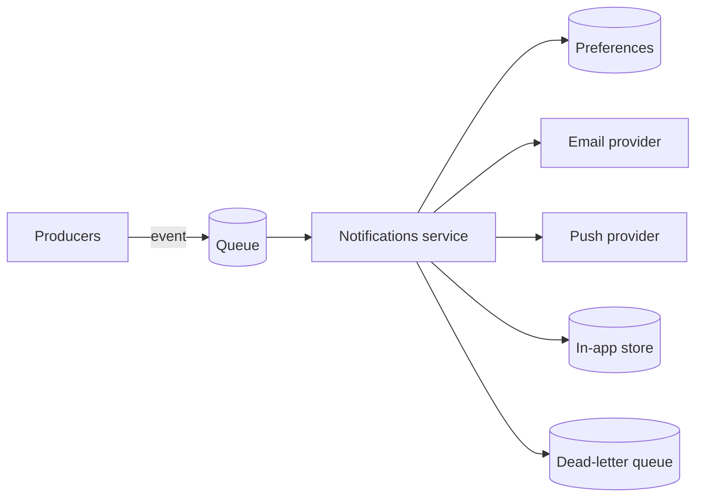
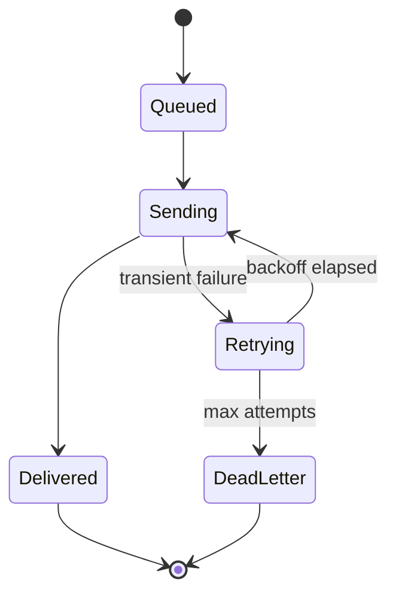

# Build a notifications service

We are extracting notifications (email, push, in-app) out of the monolith into a
standalone service driven by an event queue. The goal is one place that owns
delivery, retries, and user preferences, so product teams emit an event and never
touch a transport again.

## Architecture

## Delivery lifecycle

<Callout type='decision'>
  Delivery is at-least-once with idempotency keys, not exactly-once. Consumers
  dedupe on the key, which is far simpler than distributed exactly-once and is
  invisible to users.
</Callout>

<Phase title='Event intake and routing' status='active'>
  1. Define the notification event schema and validate on ingest.
  2. Route by channel using the user's stored preferences.

  <FileTree
    files={[
      { path: 'services/notifications/src/consumer.ts', change: 'add' },
      { path: 'services/notifications/src/router.ts', change: 'add' },
      { path: 'services/notifications/src/schema.ts', change: 'add' },
      { path: 'packages/events/notifications.ts', change: 'add' },
    ]}
  />
</Phase>

<Phase title='Transports and retries' status='planned'>
  Pluggable transport per channel, exponential backoff, dead-letter after 5 attempts.

  <Chart
    type='pie'
    title='Expected volume by channel'
    data={[
      { label: 'Email', value: 60 },
      { label: 'Push', value: 30 },
      { label: 'In-app', value: 10 },
    ]}
  />
</Phase>

<Phase title='Preferences and observability' status='planned'>
  User-facing per-channel opt-outs, plus delivery-rate and DLQ dashboards.

  <FileTree
    files={[
      { path: 'services/notifications/src/preferences.ts', change: 'add' },
      { path: 'services/notifications/src/metrics.ts', change: 'add' },
      { path: 'apps/web/settings/notifications.tsx', change: 'modify' },
    ]}
  />
</Phase>

<Callout type='risk'>
  A provider outage must not block the queue. Failures go to the DLQ and retry out of
  band, or one bad transport stalls every channel.
</Callout>
