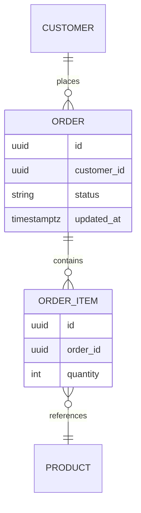

# Move the orders database to event sourcing

The orders service overwrites each row in place, so we lose the history of how an
order reached its current state. We are moving to an append-only event log with a
projected read model, keeping the existing query surface intact during the cutover.

<Callout type='decision'>
  The event log is the source of truth; the relational tables become a projection
  rebuilt from events. We keep Postgres for both, rather than adding a new store, so
  the migration stays inside infrastructure the team already runs.
</Callout>

## Current schema



## Approach

<Compare
  options={[
    { name: 'Event sourcing', pros: ['full history', 'rebuildable projections', 'natural audit'], cons: ['new read-model code', 'eventual consistency'], pick: true },
    { name: 'CRUD plus audit table', pros: ['small change', 'familiar'], cons: ['history is lossy', 'audit drifts from truth'] },
  ]}
/>

The projection is rebuilt by folding events in order:

```ts title="src/orders/projection/order-view.ts"
function project(events: OrderEvent[]): OrderView {
  return events.reduce<OrderView>((view, event) => {
    switch (event.type) {
      case 'OrderPlaced':
        return { ...view, id: event.orderId, status: 'placed', items: event.items }
      case 'OrderPaid':
        return { ...view, status: 'paid', paidAt: event.at }
      case 'OrderCancelled':
        return { ...view, status: 'cancelled' }
    }
  }, EMPTY_VIEW)
}
```

<Phase title='Write events alongside the current writes' status='done'>
  Dual-write: every command appends an event and still updates the row, so the log
  fills with real traffic while nothing depends on it yet.

  <FileTree
    files={[
      { path: 'src/orders/events/log.ts', change: 'add' },
      { path: 'src/orders/events/types.ts', change: 'add' },
      { path: 'src/orders/commands/place-order.ts', change: 'modify' },
    ]}
  />
</Phase>

<Phase title='Build and backfill the projection' status='active'>
  1. Fold the log into the `order_view` table.
  2. Backfill historical orders by synthesizing a single `OrderPlaced` event each.

  <FileTree
    files={[
      { path: 'src/orders/projection/order-view.ts', change: 'add' },
      { path: 'src/orders/queries/get-order.ts', change: 'modify' },
      { path: 'src/orders/legacy/order-row.ts', change: 'move' },
    ]}
  />
</Phase>

<Phase title='Read from the projection, stop dual-writing' status='planned'>
  Flip reads to `order_view`, then remove the in-place row update once it is unused.

  <FileTree
    files={[
      { path: 'src/orders/commands/place-order.ts', change: 'modify' },
      { path: 'src/orders/legacy/order-row.ts', change: 'delete' },
    ]}
  />
</Phase>

## Why now

Event volume is climbing, and reconstructing disputed orders by hand is already a
weekly support cost. The log pays for itself the moment a dispute needs a timeline.

<Chart
  type='line'
  title='Order events per day (thousands)'
  data={[
    { label: 'Jan', value: 41 },
    { label: 'Feb', value: 47 },
    { label: 'Mar', value: 52 },
    { label: 'Apr', value: 63 },
    { label: 'May', value: 78 },
    { label: 'Jun', value: 95 },
  ]}
/>

<Questions
  items={[
    'Do we need per-event schema versioning now, or is an upcaster enough when the first event shape changes?',
    'Should the projection rebuild run online, or do we accept a short read-only window during cutover?',
    'What is the retention policy for the raw event log once projections are trusted?',
  ]}
/>

<Callout type='warn'>
  Backfilled history is synthetic: pre-migration orders get one `OrderPlaced` event,
  not their real lifecycle. Label them so analytics does not read invented timelines.
</Callout>

<Callout type='risk'>
  Dual-write can diverge if an append succeeds and the row update fails. Wrap both in
  one transaction, and treat the event append as the commit point.
</Callout>
