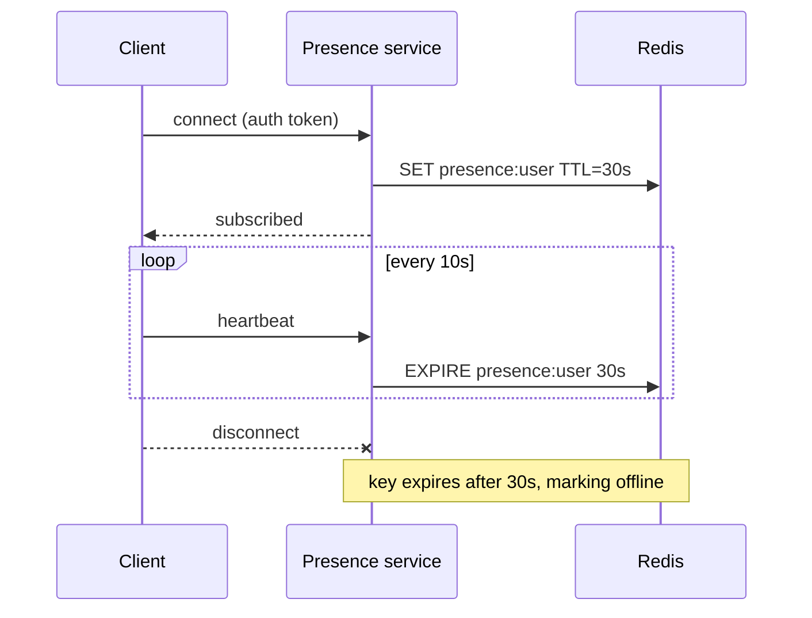
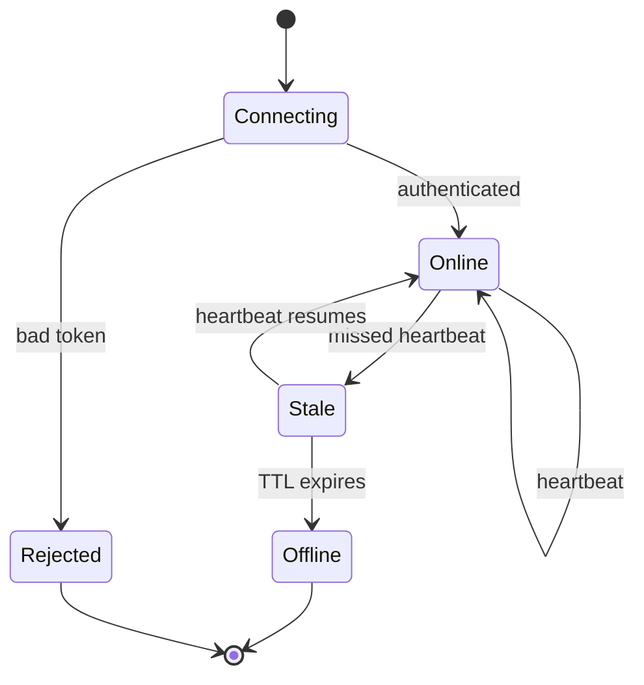
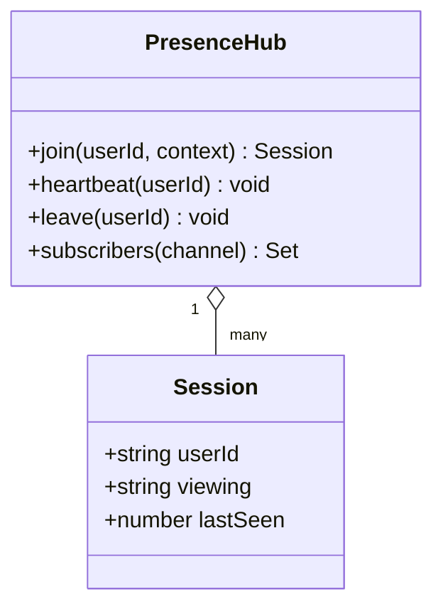

# Ship a realtime presence service

Product wants to show who is online and what they are viewing. We are building a
dedicated presence service over WebSockets so the main API is not holding a socket
per user, with presence state kept in Redis and fanned out to subscribers.

<Callout type='note'>
  Presence is best-effort, not transactional. A stale "online" for a few seconds
  after a drop is fine; a frozen "online" forever is not, so every session has a TTL.
</Callout>

## Heartbeat flow



## Connection lifecycle



## Model



## Approach

<Compare
  options={[
    { name: 'Dedicated WS service + Redis', pros: ['isolates socket load', 'horizontal scale', 'survives API deploys'], cons: ['another service to run'], pick: true },
    { name: 'Presence inside the main API', pros: ['no new service'], cons: ['sockets pinned to API nodes', 'every deploy drops everyone'] },
  ]}
/>

A subscriber registers interest in a channel and receives diffs:

```ts title="services/presence/src/fanout.ts"
hub.on('presence', (channel, change) => {
  if (change.type === 'online') broadcast(channel, { user: change.userId, viewing: change.viewing })
  if (change.type === 'offline') broadcast(channel, { user: change.userId, gone: true })
})
```

<Phase title='Socket gateway and auth' status='active'>
  Accept authenticated WebSocket connections and map them to a user session.

  <FileTree
    files={[
      { path: 'services/presence/src/gateway.ts', change: 'add' },
      { path: 'services/presence/src/auth.ts', change: 'add' },
      { path: 'services/presence/src/session.ts', change: 'add' },
    ]}
  />
</Phase>

<Phase title='Redis state and fan-out' status='planned'>
  Store presence with a TTL, publish changes, and fan out diffs to subscribers.

  <FileTree
    files={[
      { path: 'services/presence/src/store.ts', change: 'add' },
      { path: 'services/presence/src/fanout.ts', change: 'add' },
    ]}
  />
</Phase>

<Phase title='Client SDK and rollout' status='planned'>
  Ship a small client that reconnects with backoff, then enable per surface.

  <Chart
    type='bar'
    title='Estimated effort (days)'
    data={[
      { label: 'Gateway', value: 3 },
      { label: 'Redis + fanout', value: 2 },
      { label: 'Client SDK', value: 2 },
      { label: 'Rollout', value: 1 },
    ]}
  />
</Phase>

## Expected load

<Chart
  type='pie'
  title='Connections by client'
  data={[
    { label: 'Web', value: 70 },
    { label: 'Mobile', value: 22 },
    { label: 'Desktop', value: 8 },
  ]}
/>

<Questions
  items={[
    'Do we need cross-region presence on day one, or is single-region acceptable for launch?',
    'Should "viewing" context be free-form, or a fixed enum the product team owns?',
    'What is the reconnect backoff ceiling before we stop retrying and show offline?',
  ]}
/>

<Callout type='risk'>
  A Redis failover drops every TTL in flight, marking the whole fleet offline at once.
  Clients must treat a presence gap as unknown, not as everyone leaving.
</Callout>

<Callout type='warn'>
  Heartbeats every 10s across many idle tabs add up. Back off heartbeats on hidden
  tabs, or the service spends most of its budget on people who are not looking.
</Callout>
