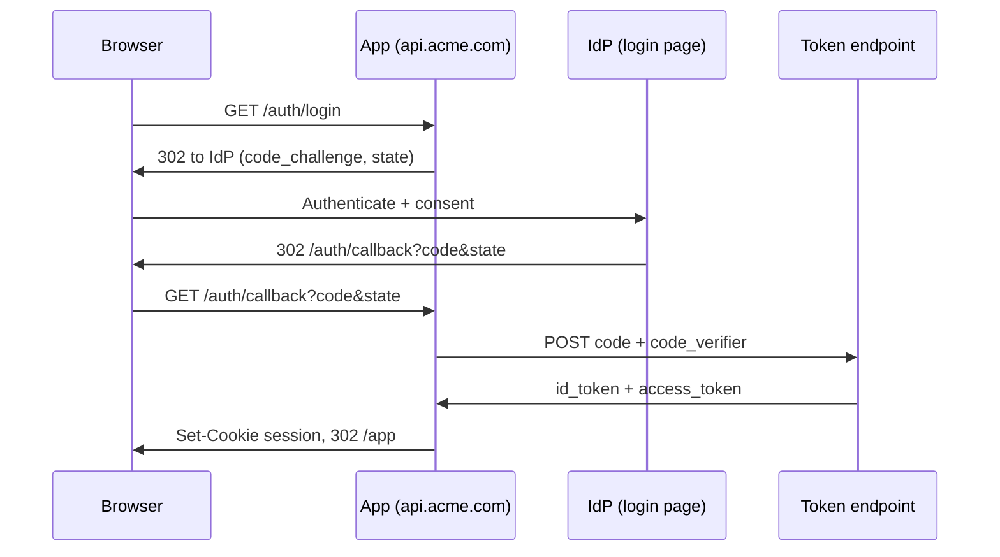

# Add SSO with OAuth2 and OIDC

Enterprise prospects keep asking for single sign-on, and our password-only login is the
last blocker on three deals. We will add OAuth2 authorization-code with PKCE and OIDC, so
users authenticate at their own identity provider and we never touch their credentials.
Existing password users keep working and link to an IdP on their next login.



<Stat>
- Providers at launch: 3 (good) -- one OIDC adapter covers all
- Est. integration: 9 days (note) -- one engineer, end to end
- Password users to migrate: 14,200 (warn) -- linked lazily on next login
- New stored secrets: 0 (good) -- IdP holds the credentials
</Stat>

<Phase title="Pick the identity providers" status="done">
Score the candidates we can ship a single OIDC adapter against. We need OIDC discovery,
PKCE, and a hosted login page so we own no credential UI.

<Matrix>
| Criterion      | Auth0 (pick) | Okta   | Cognito | Keycloak |
|----------------|--------------|--------|---------|----------|
| OIDC discovery | yes          | yes    | partial | yes      |
| PKCE support   | native       | native | native  | native   |
| Setup effort   | low          | medium | medium  | high     |
| Ops burden     | none         | none   | low     | self-run |
| Price at scale | high         | high   | low     | infra    |
</Matrix>

<Callout type="decision">
Ship Auth0 first for the fastest enterprise onboarding, then add Cognito for cost-sensitive
tiers. All three are OIDC compliant, so the adapter stays provider-agnostic and Keycloak
remains a drop-in option for on-prem customers later.
</Callout>
</Phase>

<Phase title="Model the auth flow and session" status="active">
Authorization-code with PKCE: generate a `code_verifier`, send its SHA-256 `code_challenge`
to the IdP, and exchange the returned code plus verifier for tokens. State and verifier live
in a short-lived signed cookie, never in the URL.

<FileTree>
- add src/auth/oidc-client.ts -- discovery, PKCE challenge, token exchange
- add src/auth/session.ts -- signed httpOnly cookie, 30 min sliding TTL
- modify src/server/routes.ts -- mount /auth/login and /auth/callback
- modify src/config/auth.ts -- per-provider issuer, client id, redirect uri
</FileTree>
</Phase>

<Phase title="Implement the callback handler" status="planned">
The callback validates `state`, exchanges the code with the verifier, verifies the
`id_token` signature and `nonce`, then mints our own session cookie.

```ts title="src/auth/callback.ts"
export async function handleCallback(req: Request, res: Response) {
  const { code, state } = req.query;
  const stored = readSignedCookie(req, "oidc_tx");
  if (!stored || stored.state !== state) {
    return res.status(400).json({ error: "invalid_state" });
  }

  const tokens = await oidcClient.exchange({
    code: String(code),
    codeVerifier: stored.codeVerifier,
    redirectUri: config.redirectUri,
  });

  const claims = await oidcClient.verifyIdToken(tokens.idToken, stored.nonce);
  const user = await linkOrCreateUser(claims.email, claims.sub);

  setSessionCookie(res, await createSession(user.id));
  clearCookie(res, "oidc_tx");
  return res.redirect("/app");
}
```

<Callout type="note">
The `id_token` is verified against the IdP's JWKS (cached from the discovery document), and
the `nonce` is checked against the one we stored before redirecting. Skipping either check
would let a stolen or replayed token forge a session.
</Callout>
</Phase>

<Phase title="Migrate existing password users" status="planned">
We do not force a reset. On the next login, if the IdP email matches a password account, we
link `provider_sub` to that user and retire the password hash. Until then, both paths work.

<Checklist title="Migration is safe when">
- [ ] Email match links IdP `sub` to the existing user, no duplicate row
- [ ] Password login stays enabled for unlinked accounts
- [ ] Linked accounts have their `password_hash` nulled, not deleted in place
- [ ] Mismatched email shows a clear "no matching account" error
</Checklist>
</Phase>

<Phase title="Roll out behind a flag" status="planned">
Gate the SSO buttons behind `sso_enabled` per tenant. Enable for one friendly enterprise
tenant, watch the callback error rate for a week, then open it to all tenants.

<FileTree>
- move src/legacy/passport-local.ts -> src/auth/password.ts
- modify src/server/login-page.tsx -- render IdP buttons when sso_enabled
- add test/auth/callback.test.ts -- state, nonce, and exchange coverage
</FileTree>
</Phase>

<Callout type="risk">
A token-exchange failure (IdP down, clock skew on `id_token` expiry, or a misconfigured
redirect uri) locks affected users out of login entirely. We keep password login as the
fallback during rollout and alert on any callback 5xx rate above one percent.
</Callout>

<Questions>
- Should an unmatched IdP email auto-provision a new account, or hard-fail?
- Is a 30 minute session TTL with sliding renewal acceptable for enterprise tenants?
- Do we rotate refresh tokens on every use, or only on expiry?
</Questions>

<Checklist title="Done when">
- [ ] Authorization-code with PKCE completes against all three providers
- [ ] `id_token` signature and `nonce` verified on every callback
- [ ] Session issued as an httpOnly, SameSite cookie
- [ ] Password users link on next login with no duplicate accounts
- [ ] Callback error rate under one percent for the pilot tenant
- [ ] SSO buttons gated behind the `sso_enabled` tenant flag
</Checklist>
