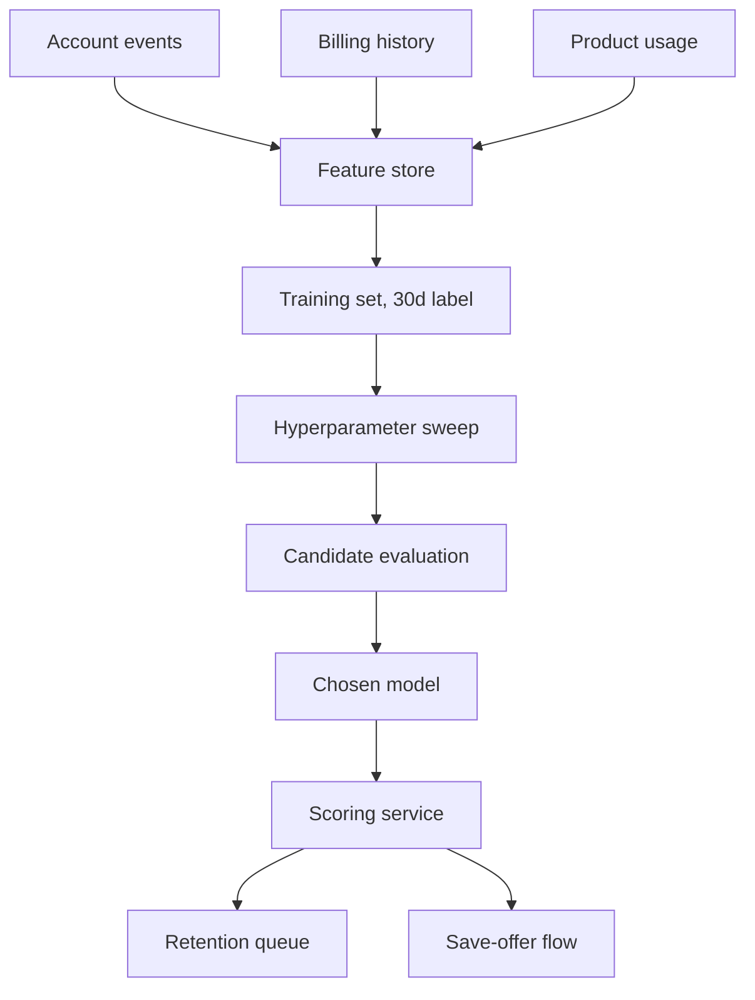

# Train and ship a churn prediction model

Subscriber churn at renewal is the largest controllable revenue leak, and the retention
team currently flags at-risk accounts by hand. The goal is a model that scores each active
account daily for its probability of cancelling within the next 30 days, surfaced to the
retention team and to an automated save-offer flow. We frame it as binary classification,
optimize calibrated probability, and judge candidates on ranking quality (AUC) and on
precision at the recall the save-offer budget can afford.



<Phase title="Frame the objective and label" status="done">
Label an account positive if it cancels within 30 days of the score date. We minimize
log loss so the output is a calibrated probability the save-offer flow can threshold on,
not just a rank.

```math
\mathcal{L} = -\frac{1}{N}\sum_{i=1}^{N} \left[ y_i \log p_i + (1 - y_i)\log(1 - p_i) \right]
```
</Phase>

<Phase title="Assemble features" status="done">
Pull from three sources into the feature store, point-in-time correct so no future
information leaks into a training row. About 40 features across engagement, billing, and
support.

<FileTree>
- add features/engagement.sql -- logins, active days, feature breadth over 7/30/90d
- add features/billing.sql -- plan tier, payment failures, discount history
- add features/support.sql -- ticket count, last-contact recency, CSAT
- modify pipelines/feature_store.py -- register the three groups, point-in-time joins
</FileTree>
</Phase>

<Phase title="Sweep hyperparameters" status="active">
Tune the gradient-boosted tree candidate with a random search over learning rate, leaf
count, and subsample, scoring each trial by validation AUC on a time-based holdout.

<Chart type="scatter" title="Learning-rate sweep (val AUC)">
| trial | learning_rate | val_auc |
|-------|---------------|---------|
| t1    | 0.01          | 0.831   |
| t2    | 0.03          | 0.857   |
| t3    | 0.05          | 0.871   |
| t4    | 0.08          | 0.878   |
| t5    | 0.12          | 0.874   |
| t6    | 0.20          | 0.862   |
| t7    | 0.30          | 0.845   |
</Chart>

<Callout type="tip">
The peak sits near a learning rate of 0.08. Rather than chase a marginally higher AUC at a
single point, pick the rate at the top of the plateau and lean on early stopping, which
holds up better when the next month of data shifts.
</Callout>
</Phase>

<Phase title="Watch for overfitting" status="active">
Track train and validation log loss per boosting round on the chosen configuration. The
two curves stay close and the validation curve flattens, so we stop where it bottoms.

<Chart type="line" title="Train vs validation log loss">
| epoch | train | val  |
|-------|-------|------|
| 10    | 0.62  | 0.64 |
| 20    | 0.54  | 0.57 |
| 30    | 0.48  | 0.52 |
| 40    | 0.44  | 0.49 |
| 50    | 0.41  | 0.47 |
| 60    | 0.39  | 0.46 |
| 70    | 0.37  | 0.46 |
| 80    | 0.35  | 0.47 |
</Chart>
</Phase>

<Phase title="Compare candidate models" status="planned">
Score three model families on the same holdout. Logistic regression is the interpretable
baseline, the gradient-boosted trees lead on AUC, and a small neural net is the upside
gamble. We weigh ranking quality against latency, interpretability, and serving cost.

<Matrix>
| Criterion        | Logistic regression | Gradient-boosted trees (pick) | Neural net |
|------------------|---------------------|-------------------------------|------------|
| AUC              | 0.82                | 0.88                          | 0.87       |
| Latency          | low                 | low                           | medium     |
| Interpretability | high                | medium                        | low        |
| Cost             | low                 | low                           | high       |
</Matrix>

<Callout type="note">
The neural net matches the trees on AUC but loses on every other axis: higher serving cost,
worse interpretability for the retention team, and no precision-recall gain at our operating
point. The boosted trees win on the whole scorecard, not just one number.
</Callout>
</Phase>

<Phase title="Ship behind a scoring service" status="planned">
Wrap the chosen model in a daily batch scoring job plus a low-latency endpoint for ad-hoc
lookups, writing scores to the retention queue and the save-offer flow. Gate the rollout
behind a flag and shadow-score for one week before any offer fires.

<FileTree>
- add services/scoring/handler.py -- load model, score an account, return calibrated p
- add services/scoring/batch.py -- nightly scoring of all active accounts
- modify retention/queue.py -- ingest scores, rank the at-risk queue
- add infra/scoring_service.tf -- endpoint, autoscaling, model artifact bucket
</FileTree>
</Phase>

<Callout type="note">
Precision-recall matters more than raw AUC here because the save-offer budget caps how many
accounts we can act on. We operate at the recall the budget affords and report precision
there, so a model that ranks well overall but is weak in the top decile is not good enough.
</Callout>

<Questions>
- What 30-day churn recall can the save-offer budget actually fund per month?
- Do we recalibrate probabilities monthly, or only on a drift alarm?
- Should canceled-then-reactivated accounts count as positive, negative, or be excluded?
- Is a daily batch score fresh enough, or does the save-offer flow need real-time scoring?
</Questions>

<Checklist title="Done when">
- [x] 30-day churn label defined and validated against historical cancellations
- [x] Feature store backfilled point-in-time correct, no label leakage
- [ ] Hyperparameter sweep complete, configuration frozen
- [ ] Boosted-tree candidate beats baseline AUC and precision at target recall
- [ ] Probabilities calibrated, reliability curve within tolerance
- [ ] Scoring service shadow-scored a full week with no incidents
- [ ] Scores flowing to the retention queue and save-offer flow behind a flag
</Checklist>
