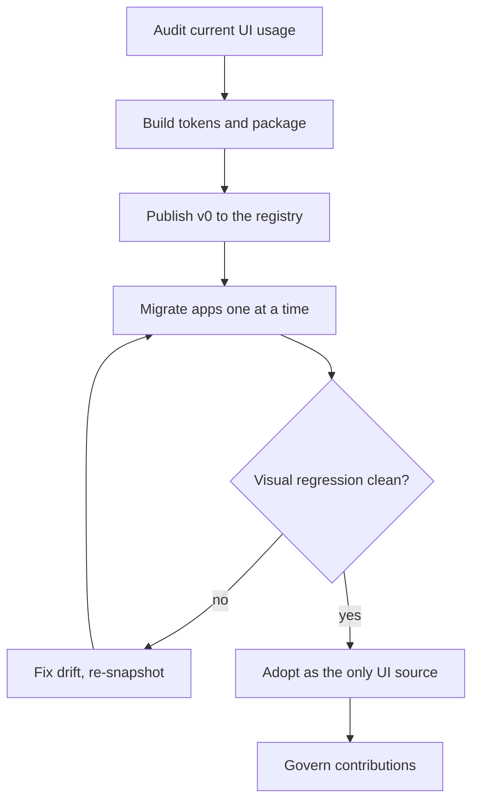

# Roll out the design system to every app

Every app ships its own buttons, modals, and form fields, so the same fix lands four times
and the products drift apart visually. This plan extracts the shared UI into a versioned
`@acme/design-system` package built on design tokens, migrates each app onto it with
codemods and visual regression as the safety net, then sets up governance so contributions
stay healthy.



<Chart type="pie" title="UI component code by app today (%)">
- Web app: 62
- Admin console: 21
- Marketing site: 11
- Mobile web: 6
</Chart>

<Callout type="note">
The web app holds most of the shared UI by sheer volume, so it becomes the source of truth:
its `src/ui` directory is what we extract first, and the other apps adopt from there rather
than each contributing a competing copy.
</Callout>

<Phase title="Audit where UI lives today" status="active">
Inventory every component across the four apps, tag duplicates, and pick the canonical
version of each. The chart above is the output: it tells us which app to extract from.

<Checklist title="Audit done when">
- [x] Component inventory exported across all four apps
- [ ] Duplicate components reconciled to one canonical version each
- [ ] Token candidates (color, spacing, type) pulled from existing CSS
</Checklist>
</Phase>

<Phase title="Decide the build approach" status="planned">
Adopt a headless primitives library and own our tokens and styling on top, versus building
every primitive in-house. This is the load-bearing call for the whole rollout.

<Compare>
## Adopt Radix primitives, own tokens (pick)
- pro: accessibility (focus, ARIA, keyboard) handled by the library
- pro: we still own tokens, theming, and visual identity
- con: a third-party dependency to track and upgrade
- con: team learns the primitive API

## Build primitives in-house
- pro: zero external dependencies, full control
- con: we re-implement accessibility from scratch and will get it wrong
- con: months of work before any app benefits
</Compare>

<Callout type="decision">
Adopt Radix for unstyled, accessible primitives and layer our tokens and components on top.
Re-building accessible primitives in-house is the kind of work that looks cheap and is not;
owning the tokens gives us the visual control that actually differentiates the product.
</Callout>
</Phase>

<Phase title="Build the package and tokens" status="planned">
Stand up `@acme/design-system`: tokens as the base layer, then components that consume them.
Move the web app's canonical `ui` directory into the package as the seed.

<FileTree>
- add packages/design-system/
- move apps/web/src/ui -> packages/design-system/src
- add packages/design-system/src/tokens.ts -- color, spacing, type scale as exports
- add packages/design-system/package.json -- versioned, published to the private registry
- modify apps/web/package.json -- depend on `@acme/design-system`
</FileTree>
</Phase>

<Phase title="Migrate apps with codemods" status="planned">
Run a codemod per app to rewrite local imports to the package, one app at a time, gated by
visual regression snapshots so silent drift fails the build instead of shipping.

```bash
npx @acme/ds-codemod apps/admin --dry-run
npx @acme/ds-codemod apps/admin --write
npm run test:visual -w apps/admin
```
</Phase>

<Phase title="Track adoption and govern" status="planned">
Publish an adoption metric per app (share of UI sourced from the package) and stand up a
lightweight RFC process for new components so the package does not re-fragment.

<Chart type="radar" title="Design system maturity: current vs target">
| dimension | current | target |
|----------------|---------|--------|
| Adoption       | 35      | 90     |
| Accessibility  | 50      | 95     |
| Token coverage | 40      | 90     |
| Documentation  | 30      | 85     |
| Visual tests   | 20      | 80     |
</Chart>

<Callout type="tip">
Track adoption as a percentage per app and put it on a shared dashboard. A visible number
turns migration from a one-off project into a metric teams keep moving on their own.
</Callout>
</Phase>

<Questions>
- Do we hard-fail CI on visual regression diffs, or require a human to approve each diff?
- Is `@acme/design-system` versioned independently, or pinned to a monorepo-wide release?
- Who owns the component RFC review, and what is the bar for adding a new primitive?
</Questions>

<Checklist title="Done when">
- [ ] `@acme/design-system` published with tokens and the seed components
- [ ] All four apps import UI only from the package
- [ ] Codemods retired after the last app migrates
- [ ] Visual regression runs in CI for every app
- [ ] Adoption dashboard live and tracked per app
- [ ] Component contribution RFC process documented
</Checklist>
