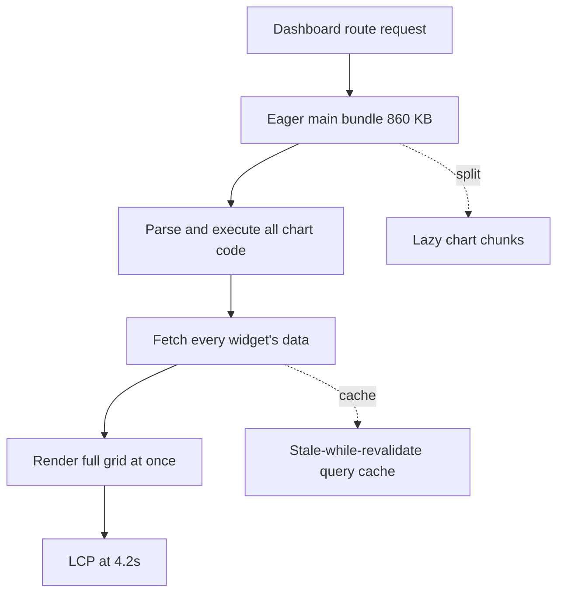

# Halve the dashboard's load time

The analytics dashboard loads slowly: Largest Contentful Paint sits at ~4.2s on
the 75th-percentile mobile profile, well past the 2.5s "good" threshold, and the
main JS bundle ships ~860 KB gzipped. The cost is concentrated in one eager
charting library and a route that fetches and renders everything up front. We
will profile to confirm the hot spots, code-split and lazy-load the heavy routes,
swap the charting dependency for a lighter one, cache the API data, then verify
against a perf budget enforced in CI.

<Stat>
- LCP now: 4.2 s (risk) -- 75th percentile, field data
- LCP target: 2.1 s (good) -- pass the 2.5 s Core Web Vitals bar
- Bundle now: 860 KB (warn) -- main chunk, gzipped
- Bundle target: 430 KB (good) -- after split and dependency swap
</Stat>



<Chart type="area" title="Projected main bundle size (KB gzipped)">
- Baseline: 860
- After code-split: 690
- After lazy charts: 540
- After dep swap: 430
</Chart>

<Chart type="gauge" title="Lighthouse performance score (mobile)">
- Score: 58
</Chart>

<Phase title="Profile and confirm the hot spots" status="active">
Capture a production trace before changing anything, so each later step has a
measured baseline rather than a guess.

<Checklist title="Captured before any change">
- [x] Lighthouse CI run saved on the dashboard route
- [x] `webpack-bundle-analyzer` treemap of the main chunk
- [ ] Chrome performance trace of the LCP path on a throttled mobile profile
</Checklist>
</Phase>

<Phase title="Code-split and lazy-load the heavy routes" status="planned">
The dashboard, reports, and settings routes all ship in the entry chunk. Split
them at the router boundary and lazy-load below-the-fold widgets so the first
paint carries only what the viewport needs.

```tsx title="src/dashboard/routes.tsx" del={1} ins={2-3}
import { ReportsPage } from "./pages/ReportsPage";
const ReportsPage = lazy(() => import("./pages/ReportsPage"));
const SettingsPage = lazy(() => import("./pages/SettingsPage"));
```
</Phase>

<Phase title="Drop the heavy charting dependency" status="planned">
The dashboard pulls in a full-featured charting suite (~210 KB gzipped) for what
is really a handful of line and area charts. Replace it with a lightweight
renderer and delete the wrapper that adapts its API.

<FileTree>
- delete src/dashboard/legacy-charts/ -- remove the heavy-suite wrapper and adapters
- modify src/dashboard/widgets/TrendCard.tsx -- render via the lighter chart primitive
- modify package.json -- drop the heavy dep, add the lightweight one
</FileTree>
</Phase>

<Phase title="Cache the data layer" status="planned">
Each widget refetches on every mount, so a single navigation triggers a burst of
duplicate requests. Move reads behind a stale-while-revalidate query cache with a
shared key per dataset.

<Callout type="tip">
With a 30s `staleTime` the grid paints instantly from cache on revisit and
refetches in the background, so perceived load time drops even when the network is
unchanged.
</Callout>
</Phase>

<Phase title="Enforce the perf budget in CI" status="planned">
Wire Lighthouse CI and a bundle-size assertion into the pipeline so a regression
fails the build instead of reaching production.
</Phase>

<Callout type="warn">
Lazy boundaries change the loading sequence, so an unsuspended chunk can flash a
blank panel or shift layout. Reserve each widget's height with a skeleton to keep
Cumulative Layout Shift under the 0.1 budget.
</Callout>

<Checklist title="Done when">
- [ ] LCP at or below 2.5 s on the throttled mobile profile (target 2.1 s)
- [ ] Total Blocking Time under 200 ms
- [ ] Cumulative Layout Shift under 0.1
- [ ] Main bundle at or below 450 KB gzipped
- [ ] Lighthouse performance score at or above 90
- [ ] CI fails on any budget regression
</Checklist>
