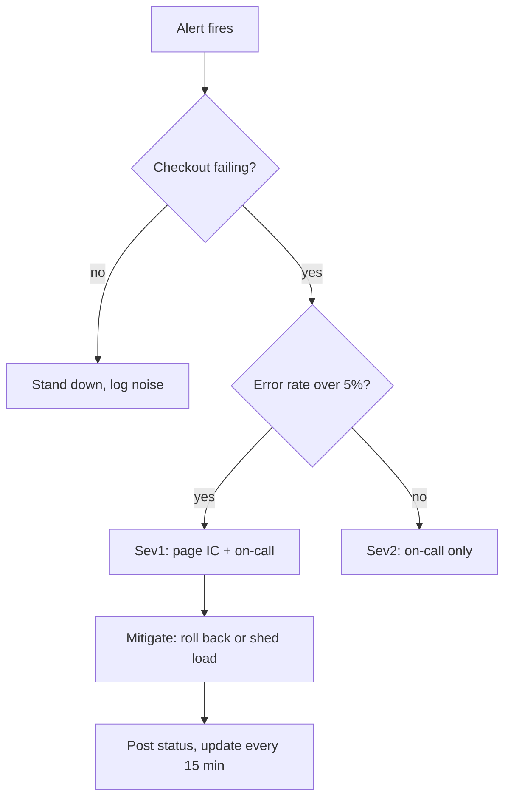

# Sev1 incident response runbook

Checkout is down. This is the on-call path from the first alert to the all-clear: triage
the severity, page the right people, mitigate fast, and keep comms flowing. Follow the
tree, hit the targets, work the checklist.

<Stat>
- Detect: under 5 min (good) -- from first failed health check to alert
- Ack: under 5 min (good) -- on-call acknowledges the page
- MTTR target: under 60 min (warn) -- alert to checkout recovered
</Stat>

<Chart type="gauge" title="Error budget remaining (%)">
- Remaining: 62
</Chart>

<Callout type="warn">
The checkout error-budget burn is fast: at the current rate the remaining 62 percent is
gone in roughly nine days. A second Sev1 this week tips us into a budget freeze.
</Callout>

<Phase title="Detect and declare" status="active">
On-call acknowledges the page, opens the incident, and assigns the incident commander (IC).
Declare the severity from the tree before touching anything.

- [ ] Acknowledge the page in PagerDuty
- [ ] Open `#inc-checkout` and pin the incident doc
- [ ] Assign IC and scribe
</Phase>

<Phase title="Assess severity" status="planned">
The IC reads the signals and confirms the severity. Error rate over 5 percent or p99 over
2s on the checkout path is a Sev1.

<Callout type="tip">
Check the deploy timeline first: most checkout Sev1s trace to a release in the last 30
minutes. A clean rollback is faster than a root-cause hunt.
</Callout>
</Phase>

<Phase title="Mitigate" status="planned">
Stop the bleeding before explaining it. Roll back the suspect deploy, or shed load by
disabling non-critical features, whichever restores checkout fastest.

- [ ] Roll back the last checkout deploy if timing matches
- [ ] Shed load: disable recommendations and upsell calls
- [ ] Confirm error rate and p99 latency recovering
</Phase>

<Phase title="Communicate" status="planned">
The IC owns comms. Post to the status page, update stakeholders in `#inc-checkout` every
15 minutes, and notify support so they can hold the line with customers.
</Phase>

<Callout type="risk">
Rolling back checkout also reverts the new tax-calculation logic. If the rollback window
crosses a pricing change, orders may compute the wrong tax until the fix re-lands. Flag
finance before rolling back across that boundary.
</Callout>

<Questions>
- Who is the backup IC when the primary is unreachable within the 5-minute ack target?
- Do we auto-page finance on any checkout rollback, or only when tax logic is in the diff?
- Is the status page update manual, or wired to the incident tool?
</Questions>

<Checklist title="Runbook checklist">
- [ ] Page acknowledged and IC assigned
- [ ] Severity declared from the triage tree
- [ ] Mitigation applied (rollback or load shed)
- [ ] Checkout error rate and p99 back to baseline
- [ ] Status page posted and stakeholders updated
- [ ] Support notified with a customer-facing message
- [ ] Postmortem scheduled within 48 hours
</Checklist>
