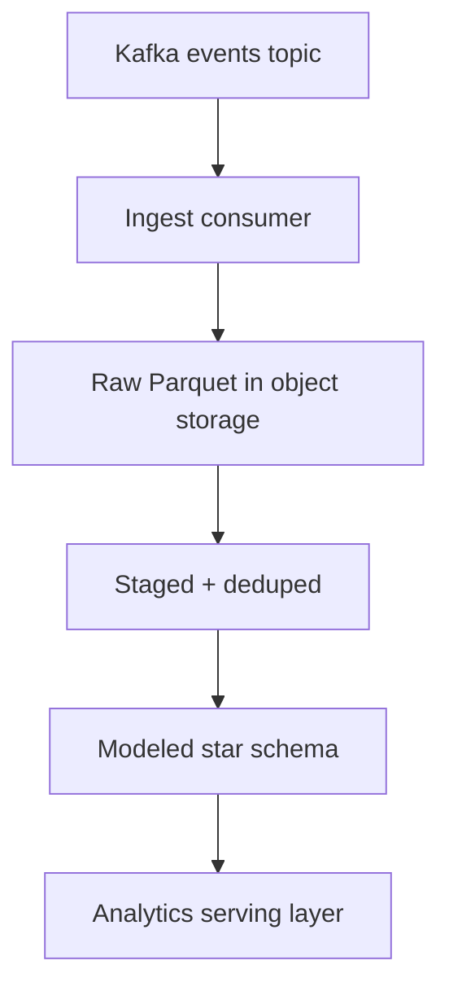
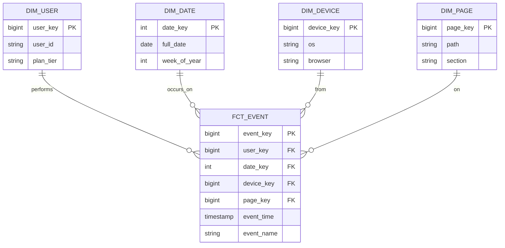

# Build the events lakehouse pipeline

Product events land in Kafka at peak rates but we have no durable, queryable history:
analysts reconstruct funnels from ad-hoc log exports that take hours and disagree with
each other. This plan stands up a lakehouse: ingest events from Kafka, land them raw as
Parquet in object storage, transform them into a modeled star schema with dbt-style
models, enforce data quality, and serve analytics from the marts layer.



<Stat>
- Events/day: 2.4B (note) -- peak 60k/s
- p95 freshness: 9 min (good) -- raw to marts
- Steady-state storage: 84 TB (note) -- all layers, Snappy Parquet
</Stat>

<Phase title="Ingest from Kafka" status="active">
A consumer group reads the `product.events` topic and writes micro-batches every 60s,
committing offsets only after a durable write so a crash replays rather than drops.

<Callout type="note">
Events carry a producer-side `event_time` and a consumer-side `ingest_time`. Partition
on `ingest_time` so a late event never rewrites an old partition; correct for true event
time downstream in the staging layer.
</Callout>
</Phase>

<Phase title="Land raw in object storage" status="planned">
Write immutable Snappy-compressed Parquet, partitioned by date and event name, sized to
roughly 128 MB files to keep the small-file count low.

```text title="s3://lake/raw/ layout"
raw/event_name=checkout/dt=2026-06-23/part-0001.parquet
raw/event_name=checkout/dt=2026-06-23/part-0002.parquet
raw/event_name=page_view/dt=2026-06-23/part-0001.parquet
```

<Chart type="treemap" title="Raw storage by dataset (GB)">
- events_raw: 1200
- page_view: 540
- checkout: 180
- add_to_cart: 95
- session_start: 60
</Chart>
</Phase>

<Phase title="Model the warehouse star schema" status="planned">
Transform staged events into a single grain-`one-row-per-event` fact table surrounded by
conformed dimensions, so analysts join on stable surrogate keys instead of raw payloads.


</Phase>

<Phase title="Transform with dbt-style models" status="planned">
Layer the models staging -> intermediate -> marts so each transform is testable in
isolation and the lineage is explicit. Deduplicate on `event_id` and resolve late
arrivals against true `event_time` here.

<FileTree>
- add models/staging/stg_events.sql -- typecast, dedupe on event_id
- add models/intermediate/int_sessions.sql -- sessionize by user and gap
- add models/marts/fct_event.sql -- one row per event at the grain
- add models/marts/dim_user.sql -- SCD2 on plan_tier changes
- modify models/sources.yml -- register the raw Parquet external tables
</FileTree>

<Callout type="risk">
Late-arriving events can land hours after their `event_time` and silently fall outside a
day's partition, undercounting that day. Reprocess a trailing 3-day window on every run
and treat marts as eventually-correct, not point-in-time frozen.
</Callout>
</Phase>

<Phase title="Enforce data quality" status="planned">
Run schema, not-null, uniqueness, and referential tests in the transform DAG; a failing
test halts the run before bad data reaches the marts.

<Chart type="funnel" title="Records surviving each stage (millions/day)">
- Ingested: 2400
- Parsed: 2360
- Deduped: 2180
- Valid schema: 2150
- Loaded to marts: 2140
</Chart>
</Phase>

<Phase title="Serve analytics" status="planned">
Expose the marts to BI and notebooks through a query engine over the same Parquet, so
serving reads the modeled tables without copying data into a separate warehouse.

<Chart type="bar" stacked title="Storage growth by layer (TB)">
| month | raw | staged | marts |
|-------|-----|--------|-------|
| Jan   | 18  | 9      | 4     |
| Feb   | 23  | 11     | 5     |
| Mar   | 29  | 14     | 6     |
| Apr   | 36  | 17     | 7     |
</Chart>
</Phase>

<Phase title="Choose the query engine" status="planned">
Score three engines for the serving layer against operational fit. Rationale is in the
callout below, not in the cells.

<Matrix>
| Dimension      | Trino (pick) | DuckDB  | Spark SQL |
|----------------|--------------|---------|-----------|
| Concurrency    | high         | low     | medium    |
| Ops burden     | medium       | low     | high      |
| Parquet scans  | high         | high    | high      |
| Large joins    | high         | medium  | high      |
| Cost           | medium       | low     | high      |
</Matrix>

<Callout type="decision">
We pick Trino: it handles the concurrent BI workload that DuckDB cannot and avoids the
cluster-management overhead Spark SQL imposes for interactive queries. DuckDB stays as
the local engine analysts use against single-day extracts.
</Callout>
</Phase>

<Checklist title="Done when">
- [ ] Kafka consumer writes raw Parquet with offsets committed after durable write
- [ ] Raw layer partitioned by ingest date and event name, files near 128 MB
- [ ] Star schema fact and dimension tables build from dbt-style models
- [ ] Late-arriving events reprocessed over a trailing 3-day window
- [ ] Data-quality tests gate the marts and halt on failure
- [ ] Trino serves the marts with p95 freshness under 10 minutes
</Checklist>
