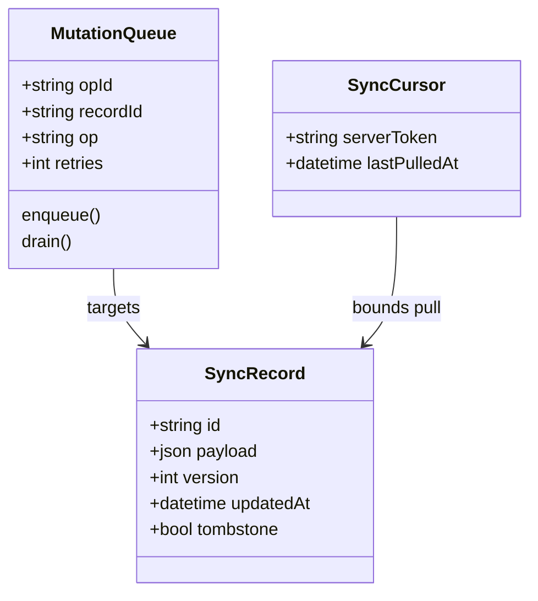

# Offline-first sync for the mobile app

The app assumes a live connection, so a dropped signal blocks reads and silently
loses writes. We will keep a local store as the source of truth for the UI, queue
every mutation while offline, and reconcile against the server with a sync cursor
when connectivity returns. Conflicts and deletes are the hard part, so we model
tombstones and a resolution strategy up front.

<Phase title="Model the local store and tombstones" status="done">
Define `SyncRecord` as the local row with a monotonic `version` and a `tombstone`
flag so deletes replicate instead of vanishing. The queue and cursor are separate
local tables.

<FileTree>
- add src/sync/schema.ts -- SyncRecord, MutationQueue, SyncCursor tables
- add src/sync/local-store.ts -- read/write SyncRecords, soft-delete via tombstone
- modify src/db/migrations/index.ts -- create the three sync tables
</FileTree>
</Phase>

<Phase title="Choose a conflict-resolution strategy" status="active">
The strategy decides what happens when the same record changed on two devices. We
pick the lighter option that fits our data shape, with field-level merge as the
escape hatch for the few records that need it.

<Compare>
## Last-write-wins (pick)
- pro: trivial to implement with `version` plus `updatedAt`
- pro: deterministic, no merge state to store or replay
- con: a losing edit is discarded silently
- con: needs a per-field override for records users co-edit

## CRDT / operational merge
- pro: no lost writes, concurrent edits converge
- pro: works for collaborative text and counters
- con: heavier runtime and on-device storage
- con: every type needs a bespoke merge function
</Compare>
</Phase>

<Phase title="Build the sync engine" status="planned">
A single engine drains the `MutationQueue` to the server, then pulls changes since
the `SyncCursor` token and applies them through the resolver.

<FileTree>
- add src/sync/engine.ts -- push queue, pull by cursor, resolve, advance token
- add src/sync/resolver.ts -- last-write-wins with per-field overrides
- add src/sync/mutation-queue.ts -- enqueue, drain, backoff on retries
</FileTree>
</Phase>

<Phase title="Wire connectivity and roll out" status="planned">
Trigger a sync on reconnect and on app foreground, behind a flag so we can enable
it per cohort and fall back to online-only instantly.

<FileTree>
- add src/sync/connectivity.ts -- reconnect and foreground triggers
- modify src/app/providers.tsx -- mount the sync engine behind the flag
</FileTree>
</Phase>

<Callout type="decision">
Default to last-write-wins keyed on `version`, with a small allowlist of records
(notes, tags) that use field-level merge. This keeps the common path cheap and
reserves the expensive merge for the few types that genuinely need it.
</Callout>

<Callout type="risk">
A queued mutation against a record the server already tombstoned would resurrect a
deleted row. The engine must check the tombstone on apply and drop the orphaned
mutation, or a delete on one device silently undoes on another.
</Callout>

<Questions>
- Should the sync cursor be a server-issued opaque token or a client timestamp?
- How long do we retain tombstones before the server may garbage-collect them?
- Does a queued mutation that fails validation server-side roll back the local row or surface a conflict to the user?
- What is the max queue depth before we force a full resync instead of replaying?
</Questions>

<Checklist title="Done when">
- [x] Local store reads and writes work fully offline
- [ ] Mutations queue offline and drain in order on reconnect
- [ ] Pull applies server changes since the cursor and advances the token
- [ ] Last-write-wins resolves conflicts deterministically by version
- [ ] Tombstones replicate, and a mutation against a tombstoned record is dropped
- [ ] Sync runs behind a flag with an online-only fallback
</Checklist>
