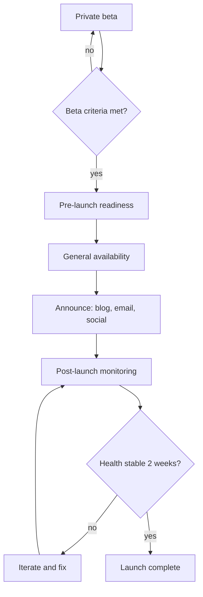

# Launch the Insights dashboard

Insights is our new analytics dashboard, feature-complete and in private beta with 40
accounts. This plan takes it from closed beta to general availability: validate with the
beta cohort, line up marketing and support, ship to everyone behind a flag, then run a
two-week stabilization window before declaring the launch done.

<Phase title="Beta: prove it holds up" status="active">
Keep the 40 beta accounts engaged, instrument activation and weekly retention, and run
five guided interviews to surface blocking gaps. Exit beta only when the numbers and the
qualitative signal both clear the bar.

<Chart type="bar" title="Projected signups by week (thousands)">
- Week 1: 2
- Week 2: 5
- Week 3: 9
- Week 4: 12
</Chart>
</Phase>

<Phase title="Pre-launch readiness" status="planned">
Marketing, support, and sales need to be ready the day the flag flips. This is the
workstream most likely to slip, so it gets explicit owners and effort estimates.

<Chart type="bar" title="Effort by workstream (person-days)">
- Docs: 4
- Marketing: 6
- Support: 3
- Sales enablement: 2
</Chart>
</Phase>

<Phase title="Decide the GA timing" status="planned">
We can launch on the current feature set now, or hold two weeks for scheduled exports,
the single most requested beta ask.

<Compare>
## Launch now (pick)
- pro: captures the quarter and current marketing momentum
- pro: real GA usage tells us if exports even matter at scale
- con: ships without the top beta feature request
- con: risks a lukewarm "why no exports" reception

## Wait for scheduled exports
- pro: launches with the most-requested capability included
- pro: a more complete first impression
- con: slips two weeks and misses the quarter
- con: bets two weeks of delay on an unvalidated assumption
</Compare>

<Callout type="decision">
Launch now, ship scheduled exports as a fast follow. The beta signal on exports is
strong but narrow, and a real GA cohort will tell us far more about its priority than
two more weeks of speculation. We pre-announce exports as "coming next month" to blunt
the gap.
</Callout>
</Phase>

<Phase title="General availability" status="planned">
Flip the flag for all accounts in a staged rollout (10 percent, then 50, then 100),
publish the launch blog post, send the announcement email, and post to social on the
same day reads go to 100 percent.
</Phase>

<Phase title="Post-launch monitoring" status="planned">
Watch activation, error rate, and support ticket volume daily for two weeks. Triage
incoming feedback into the fast-follow backlog and hold a launch retro at the end of the
window.
</Phase>

<Questions>
- What is the activation threshold that lets us exit beta with confidence?
- Do we gate GA on a support staffing level, or launch and staff reactively?
- Is the staged rollout by account percentage or by plan tier?
- Who owns the go or no-go call on launch day, and what is the rollback trigger?
</Questions>

<Checklist title="Launch criteria">
- [ ] Beta activation and week-2 retention clear the agreed bar
- [ ] Docs, in-app help, and changelog published
- [ ] Support team trained, runbook and canned responses ready
- [ ] Marketing assets approved: blog, email, social
- [ ] Staged rollout plan and rollback trigger agreed
- [ ] Dashboards live for activation, errors, and tickets
- [ ] Scheduled exports pre-announced as a fast follow
</Checklist>
