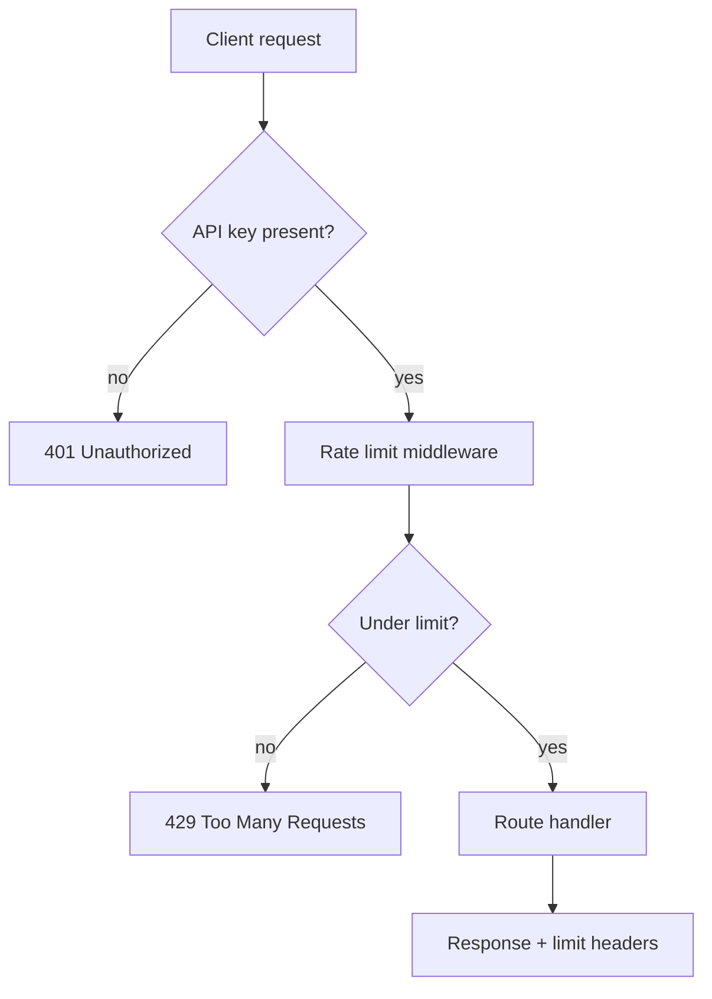

# Add rate limiting to the API

The public API has no per-client throttling, so a single noisy client can exhaust
database connections and degrade latency for everyone. We will add a gateway
middleware that counts requests per API key in a sliding window, returns `429` with a
`Retry-After` header once a client is over budget, and exposes the limiter state on
response headers so clients can self-throttle.



<Phase title="Pick the counter store and window" status="done">
We need an atomic, shared counter so the limit holds across all gateway nodes. A
single Redis round trip per request is acceptable at our p95 budget.

<Compare>
## Redis sliding window (pick)
- pro: accurate across all nodes, no per-node drift
- pro: one atomic Lua script, no race between read and increment
- con: adds a network hop on every request
- con: a Redis outage needs an explicit fail-open or fail-closed policy

## In-memory token bucket
- pro: zero network latency, trivial to implement
- pro: no extra infrastructure
- con: per-node only, so the real limit is `N * limit` across N nodes
- con: counters reset on deploy or restart
</Compare>
</Phase>

<Phase title="Implement the middleware" status="active">
Add a `rateLimiter` middleware in front of the router. It derives the key from the
authenticated API key, runs the sliding-window script, and short-circuits with `429`
when the client is over budget.

```ts title="src/gateway/rate-limiter.ts" ins={9-13} mark={4}
export async function rateLimiter(req: Request, res: Response, next: NextFunction) {
  const key = `ratelimit:${req.apiKey}`;
  const { allowed, remaining, resetAt } = await slidingWindow(redis, key, {
    limit: 100,
    windowSeconds: 60,
  });

  res.setHeader("X-RateLimit-Limit", "100");
  res.setHeader("X-RateLimit-Remaining", String(remaining));
  if (!allowed) {
    res.setHeader("Retry-After", String(resetAt - nowSeconds()));
    return res.status(429).json({ error: "rate_limited" });
  }
  next();
}
```
</Phase>

<Phase title="Wire it into the gateway" status="planned">
Mount the middleware after auth (so the key exists) and before routing. Ship behind a
config flag so we can enable it per environment and roll back instantly.

<FileTree>
- add src/gateway/rate-limiter.ts
- add src/gateway/sliding-window.lua
- modify src/gateway/middleware.ts
- modify src/config/index.ts
- add test/gateway/rate-limiter.test.ts
</FileTree>
</Phase>

<Phase title="Observe and tune" status="planned">
Emit a metric per decision (`allowed` / `limited`) tagged by API key tier, then watch
the limited rate for a week before tightening the default budget.
</Phase>

<Callout type="risk">
If Redis is unreachable the middleware must choose a policy. Failing closed turns a
Redis blip into a full API outage; failing open silently removes all protection during
the exact window an attacker would exploit. We default to fail-open with a loud alert,
since availability outranks throttling for our traffic profile.
</Callout>

<Checklist title="Done when">
- [x] Sliding-window Lua script is atomic under concurrent requests
- [ ] Returns 429 with a correct `Retry-After` once a client is over budget
- [ ] `X-RateLimit-*` headers present on every authenticated response
- [ ] Fail-open path verified with Redis down, alert fires
- [ ] Limit configurable per environment behind a flag
- [ ] Decision metric visible on the gateway dashboard
</Checklist>
