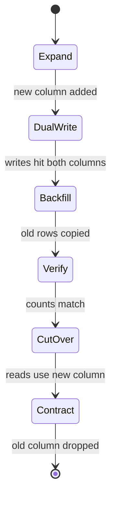

# Zero-downtime migration of the orders table

The `orders` table stores `amount_cents` as a 32-bit integer, which overflows above
about 21 million dollars and now blocks enterprise contracts. We need to widen it to a
64-bit `bigint` on a table with roughly 80 million live rows, without a write lock that
takes the checkout path offline. The plan uses the expand-migrate-contract pattern: add
a new column, dual-write to both, backfill in batches, cut reads over, then drop the old
column.

<Phase title="Choose the strategy" status="done">
A naive `ALTER COLUMN TYPE` rewrites the whole table under an `ACCESS EXCLUSIVE` lock,
which is a non-starter at this size. We score three approaches.

<Matrix>
| Criterion        | In-place ALTER | Expand/contract (pick) | Logical replica swap |
|------------------|----------------|------------------------|----------------------|
| Downtime         | hours          | none                   | seconds              |
| Rollback ease    | hard           | easy                   | medium               |
| Operational risk | high           | low                    | high                 |
| Extra infra      | none           | none                   | replica + cutover    |
| Effort           | low            | medium                 | high                 |
</Matrix>

<Callout type="decision">
We pick expand/contract. It needs no extra infrastructure, every step is independently
reversible, and the only cost is carrying a temporary duplicate column. The replica
swap would cut downtime further but adds a fragile cutover and a whole replica to manage
for a change this routine.
</Callout>
</Phase>

<Phase title="Expand: add the new column" status="active">
Add `amount_cents_v2 bigint` as nullable with no default, so it is a metadata-only
change and takes no table rewrite. Deploy the app code that writes both columns on every
insert and update before touching any existing data.

<FileTree>
- add migrations/0042_add_amount_cents_v2.sql
- add migrations/0043_backfill_amount_cents_v2.sql
- modify src/orders/repository.ts
- modify src/orders/model.ts
- add scripts/backfill-orders.ts
</FileTree>
</Phase>

<Phase title="Backfill in batches" status="planned">
Copy existing rows in batches of 10k by primary-key range, sleeping between batches to
keep replication lag and lock contention low. The job is idempotent and resumable, so a
mid-run failure just restarts from the last committed batch.

<Chart type="bar" title="Estimated rows per phase (millions)">
- Expand: 0
- Backfill: 80
- Verify: 80
- Cutover: 0
- Contract: 0
</Chart>
</Phase>

<Phase title="Verify and cut over" status="planned">
Confirm zero rows where the two columns disagree, then deploy the read switch so queries
select `amount_cents_v2`. Keep dual-writes on for one more release as an escape hatch.
</Phase>

<Phase title="Contract: drop the old column" status="planned">
Once a full release has run on the new column with no incidents, stop dual-writing and
drop `amount_cents`. This is the only irreversible step, so it ships on its own.
</Phase>

<Callout type="risk">
The backfill competes with live traffic for I/O. A batch size that is too large stalls
checkout writes and spikes replication lag. Start at 10k rows per batch with a 200ms
pause, watch lag, and back off if it climbs. Never run the backfill inside a single
transaction; one 80M-row transaction will exhaust WAL and lock everything.
</Callout>

<Checklist title="Done when">
- [x] `amount_cents_v2` added as nullable, no table rewrite
- [ ] App dual-writes both columns on insert and update
- [ ] Backfill complete, zero rows where the columns disagree
- [ ] Reads switched to `amount_cents_v2` for one full release
- [ ] Dual-write removed and old column dropped
- [ ] Replication lag stayed within budget throughout
</Checklist>
