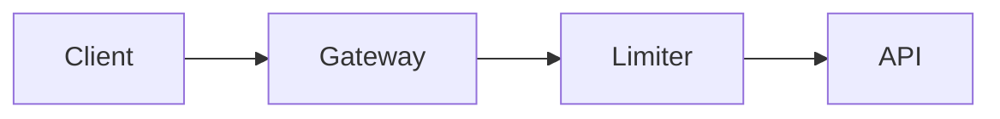

# Authoring plans

A plan is an MDX file. It begins with a single `# Title` heading (there is no frontmatter), then
uses a fixed, tiny component vocabulary. You never write `import` statements, the components are
always in scope. Use the ones that fit the plan and skip the rest.

The vocabulary is general. Although the examples below are code-flavored, it fits any structured
plan, a product launch, a research agenda, an incident response, not just software changes.

> Run `vplan components` anytime for the exact prop signatures.

## Data as markdown children

The data components (`FileTree`, `Chart`, `Compare`, `Matrix`, `Questions`, `Checklist`) take
their data as **markdown children**, not props: write a normal markdown list (or, for `Matrix` and
a multi-series `Chart`, a markdown table) between the tags. Only the scalar settings (`title`,
`type`, `status`) are attributes. This is fewer tokens and avoids the brace errors that break a
render.

## Phase

`<Phase title="..." status="planned|active|done">`, one step in a numbered vertical timeline. It
wraps markdown (ordered lists, prose, nested components) and the steps auto-number in order. Use
one per major step of the plan.

```mdx
<Phase title="Build the limiter" status="active">
  Implement the Redis-backed window and return 429 over the limit.
</Phase>
```

## Mermaid diagrams

A ` ```mermaid ` fenced block. Reach for this first for anything structural: architecture
(`flowchart`), `sequenceDiagram`, dependency graphs, `stateDiagram-v2`, `classDiagram`,
`erDiagram`, and `xychart-beta`.

````mdx

````

`gantt` and `pie` are not supported (use `<Chart>` for quantitative data). `check` validates each
diagram, so an unsupported type fails with a `file:line:col` instead of rendering an error box.

## Math

A ` ```math ` fenced block, a display formula written in LaTeX, typeset as math (complexity
bounds, probabilities, linear algebra).

````mdx
```math
T(n) = O(n \log n)
```
````

## Callout

`<Callout type="note|tip|risk|decision|warn">`, highlight a risk, decision, tip, or note. It wraps
markdown. `note` is blue, `tip` is green, `decision` is purple, `risk` is red, `warn` is yellow.

```mdx
<Callout type="risk">
  A Redis outage must fail open, not closed.
</Callout>
```

## FileTree

`<FileTree>`, a file-change map. One bullet per file, `- <change> <path>`, where `change` is
`add`, `modify`, `delete`, or `move`. A move needs both ends, `- move <from> -> <to>`. A path
ending in `/` marks a whole directory.

```mdx
<FileTree>
- add src/gateway/rate-limiter.ts
- modify src/gateway/middleware.ts
- delete src/gateway/legacy/
</FileTree>
```

## Chart

`<Chart type="bar|line|pie" title="...">`, estimates and metrics. For a single series, one bullet
per point, `- <label>: <value>`. For multiple series (bar/line only), write a table whose header is
`category | series1 | series2`. `pie` is always single-series, so use the list form for it.

```mdx
<Chart type="bar" title="Effort (days)">
- Limiter: 2
- Dashboards: 1
</Chart>

<Chart type="line" title="Latency by stage (ms)">
| Stage | p50 | p95 |
|-------|-----|-----|
| Auth  | 12  | 30  |
| DB    | 40  | 120 |
</Chart>
```

## Compare

`<Compare>`, weigh approaches side by side as pros/cons cards. Each option is a `## Name` heading
(append `(pick)` to mark the recommended one) followed by `- pro:` / `- con:` bullets.

```mdx
<Compare>
## Redis sliding window (pick)
- pro: accurate
- pro: shared across nodes
- con: network hop

## In-memory token bucket
- pro: fast
- con: per-node only
</Compare>
```

## Matrix

`<Matrix>`, a comparison grid (options across the columns, criteria down the rows) for scoring
several choices against several dimensions. Write a markdown table; the first column is the row
labels, and you append `(pick)` to one column header to highlight it. Use `<Compare>` for
pros/cons, `<Matrix>` for a scorecard.

```mdx
<Matrix>
| Dimension | Postgres (pick) | ClickHouse | DynamoDB |
|-----------|-----------------|------------|----------|
| Writes    | medium          | high       | high     |
| Querying  | high            | medium     | low      |
</Matrix>
```

## Questions

`<Questions>`, open questions you want the reader to resolve before building, one per bullet. The
title defaults to "Open questions"; override with `title="..."`.

```mdx
<Questions>
- Should the limiter fail open or fail closed if Redis is unreachable?
- Is a 15-minute access-token TTL acceptable?
</Questions>
```

## Checklist

`<Checklist title="Done when">`, acceptance criteria as a markdown task list: `- [x]` for done,
`- [ ]` for todo.

```mdx
<Checklist title="Done when">
- [x] Returns 429 over the limit
- [ ] Dashboards live
</Checklist>
```

## Code blocks

Fenced code blocks are syntax-highlighted. Add a file name with
` ```ts title="src/path/file.ts" ` to render a filename header on the block. Mark lines and text
with Expressive Code props in the fence meta string, `mark` (neutral), `ins` (green), `del` (red),
each taking line numbers, ranges, quoted strings, or a `/regex/`:

- Lines and ranges: `{2}`, `{2-4}`, `{1, 3, 5-6}`
- Typed lines: `ins={3-4} del={2} mark={6}`
- Inline text: `"TokenBucket"`, a rename as `del="oldName" ins="newName"`

## Guidance

- Lead with structure: an optional one-paragraph context, then a mermaid diagram, then `<Phase>`
  sections. Put risks and decisions in `<Callout>`s, not buried in prose.
- Right-size the structure to the change. A two-or-three-file change may need only a short
  `<FileTree>` and a `<Checklist>`. An empty two-node diagram is worse than no diagram.
- In prose, `<`, `{`, and `}` are MDX syntax. Wrap literal angle brackets, braces, or generics
  (`List<T>`) in backticks, where every character is safe and literal.
- No images or external assets. The page is a single self-contained file, so a markdown image
  cannot be embedded; `check` rejects them. Use a mermaid diagram or describe it in text.
- Raw inline HTML tags (`<kbd>`, `<sub>`, `<details>`) do not render, they read as unknown
  components and fail `check`. Use backticks or plain text instead.
- Always [`check`](/docs/cli/) before presenting, so the user never sees a broken render.
