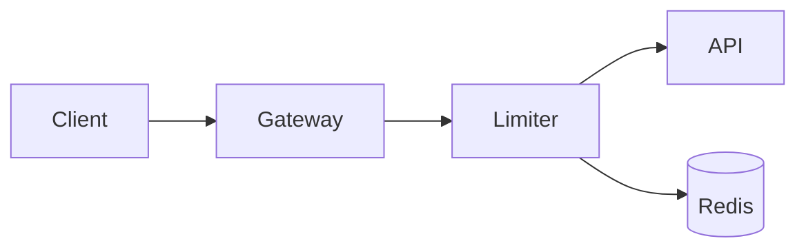

import Demo from '../../components/Demo.astro'
import { Phase } from '@visualplan/runtime/components/Phase'
import { Callout } from '@visualplan/runtime/components/Callout'
import { FileTree } from '@visualplan/runtime/components/FileTree'
import { Chart } from '@visualplan/runtime/components/Chart'
import { Compare } from '@visualplan/runtime/components/Compare'
import { Matrix } from '@visualplan/runtime/components/Matrix'
import { Questions } from '@visualplan/runtime/components/Questions'
import { Checklist } from '@visualplan/runtime/components/Checklist'
import { Mermaid } from '@visualplan/runtime/components/Mermaid'
import { MathBlock } from '@visualplan/runtime/components/Math'
import temml from 'temml'

export const sumFormula = temml.renderToString('\\sum_{i=1}^{n} i = \\frac{n(n+1)}{2}')

# Authoring plans

A plan is an MDX file. It begins with a single `# Title` heading (there is no frontmatter), then
uses a fixed, tiny component vocabulary. You never write `import` statements: the components are
always in scope. Use the ones that fit the plan and skip the rest.

The vocabulary is general. Although the examples below are code-flavored, it fits any structured
plan, a product launch, a research agenda, an incident response, not just software changes. Every
component on this page is shown twice: the MDX you write, and directly beneath it, the **live
rendered result**, the same components the `vplan` CLI compiles into a plan.

> Run `vplan components` anytime for the exact prop signatures, or open a complete plan from the
> **Examples** list in the sidebar.

## Data as markdown children

The data components (`FileTree`, `Chart`, `Compare`, `Matrix`, `Questions`, `Checklist`) take their
data as **markdown children**, not props: write a normal markdown list (or, for `Matrix` and a
multi-series `Chart`, a markdown table) between the tags. Only the scalar settings (`title`, `type`,
`status`) are attributes. This is fewer tokens and avoids the brace errors that break a render.

## Phase

`<Phase title="..." status="planned|active|done">`, one step in a numbered vertical timeline. It
wraps markdown (ordered lists, prose, nested components) and the steps auto-number in document
order, so you never write the numbers. Use one per major step of the plan; `status` colors the node
(active is filled ink, done is green).

````mdx
<Phase title="Build the limiter" status="done">
  Implement the Redis-backed sliding window.
</Phase>

<Phase title="Wire the middleware" status="active">
  Reject over-limit requests with a 429 and a Retry-After header.
</Phase>

<Phase title="Dashboards" status="planned">
  Emit metrics and chart rejection rates.
</Phase>
````

<Demo>
  <Phase title="Build the limiter" status="done">Implement the Redis-backed sliding window.</Phase>
  <Phase title="Wire the middleware" status="active">Reject over-limit requests with a 429 and a Retry-After header.</Phase>
  <Phase title="Dashboards" status="planned">Emit metrics and chart rejection rates.</Phase>
</Demo>

## Mermaid diagrams

A ` ```mermaid ` fenced block. Reach for this first for anything structural: architecture
(`flowchart`), `sequenceDiagram`, dependency graphs, `stateDiagram-v2`, `classDiagram`, `erDiagram`,
and `xychart-beta`. The diagram colors track the page theme automatically.

````mdx

````

<Demo>
  <Mermaid chart={'flowchart LR\n  Client --> Gateway --> Limiter --> API\n  Limiter --> Redis[(Redis)]'} />
</Demo>

`gantt` and `pie` are not supported (use `<Chart>` for quantitative data). `check` validates each
diagram, so an unsupported type fails with a `file:line:col` instead of rendering an error box.

## Math

A ` ```math ` fenced block, a display formula written in LaTeX, typeset as math (complexity bounds,
probabilities, linear algebra). It is converted to MathML at build time, so no math library ships
to the browser and the equation tracks the theme.

````mdx
```math
\sum_{i=1}^{n} i = \frac{n(n+1)}{2}
```
````

<Demo>
  <MathBlock html={sumFormula} />
</Demo>

## Callout

`<Callout type="note|tip|risk|decision|warn">`, highlight a risk, decision, tip, or note. It wraps
markdown. Each type has its own color and icon, so they stay distinct at a glance.

````mdx
<Callout type="decision">
  We chose the Redis sliding window for accuracy across nodes.
</Callout>

<Callout type="risk">
  A Redis outage must fail open, not closed.
</Callout>
````

<Demo>
  <Callout type="note">A neutral note for context the reader needs.</Callout>
  <Callout type="tip">A small tip that improves the result.</Callout>
  <Callout type="decision">We chose the Redis sliding window for accuracy across nodes.</Callout>
  <Callout type="risk">A Redis outage must fail open, not closed.</Callout>
  <Callout type="warn">This migration briefly locks the table under load.</Callout>
</Demo>

## FileTree

`<FileTree>`, a file-change map. One bullet per file, `- <change> <path>`, where `change` is `add`,
`modify`, `delete`, or `move`. A move needs both ends, `- move <from> -> <to>`. A path ending in `/`
marks a whole directory.

````mdx
<FileTree>
- add src/gateway/rate-limiter.ts
- modify src/gateway/middleware.ts
- delete src/gateway/legacy/
</FileTree>
````

<Demo>
  <FileTree files={[
    { path: 'src/gateway/rate-limiter.ts', change: 'add' },
    { path: 'src/gateway/middleware.ts', change: 'modify' },
    { path: 'src/gateway/legacy/', change: 'delete' },
  ]} />
</Demo>

## Chart

`<Chart type="bar|line|pie" title="...">`, estimates and metrics, backed by real, interactive
charts. For a single series, one bullet per point, `- <label>: <value>`. For multiple series
(bar/line only), write a table whose header is `category | series1 | series2`. `pie` is always
single-series, so use the list form for it.

````mdx
<Chart type="bar" title="Effort (days)">
- Limiter: 2
- Dashboards: 1
- Tests: 1.5
</Chart>
````

<Demo>
  <Chart client:only="react" type="bar" title="Effort (days)" data={{ series: ['value'], data: [{ label: 'Limiter', values: [2] }, { label: 'Dashboards', values: [1] }, { label: 'Tests', values: [1.5] }] }} />
</Demo>

Multiple series come from a markdown table, one column per series:

````mdx
<Chart type="line" title="Latency by stage (ms)">
| Stage  | p50 | p95 |
|--------|-----|-----|
| Auth   | 12  | 30  |
| DB     | 40  | 120 |
| Render | 8   | 22  |
</Chart>
````

<Demo>
  <Chart client:only="react" type="line" title="Latency by stage (ms)" data={{ series: ['p50', 'p95'], data: [{ label: 'Auth', values: [12, 30] }, { label: 'DB', values: [40, 120] }, { label: 'Render', values: [8, 22] }] }} />
</Demo>

A `pie` chart renders its slices with a percentage legend:

<Demo>
  <Chart client:only="react" type="pie" title="Traffic by client" data={{ series: ['value'], data: [{ label: 'Web', values: [62] }, { label: 'Mobile', values: [28] }, { label: 'API', values: [10] }] }} />
</Demo>

## Compare

`<Compare>`, weigh approaches side by side as pros/cons cards. Each option is a `## Name` heading
(append `(pick)` to mark the recommended one) followed by `- pro:` / `- con:` bullets.

````mdx
<Compare>
## Redis sliding window (pick)
- pro: accurate
- pro: shared across nodes
- con: network hop

## In-memory token bucket
- pro: fast
- con: per-node only
</Compare>
````

<Demo>
  <Compare options={[
    { name: 'Redis sliding window', pros: ['accurate', 'shared across nodes'], cons: ['network hop'], pick: true },
    { name: 'In-memory token bucket', pros: ['fast'], cons: ['per-node only'] },
  ]} />
</Demo>

## Matrix

`<Matrix>`, a comparison grid (options across the columns, criteria down the rows) for scoring
several choices against several dimensions. Write a markdown table; the first column is the row
labels, and you append `(pick)` to one column header to highlight it. Use `<Compare>` for pros/cons,
`<Matrix>` for a scorecard.

````mdx
<Matrix>
| Dimension | Postgres (pick) | ClickHouse | DynamoDB |
|-----------|-----------------|------------|----------|
| Writes    | medium          | high       | high     |
| Querying  | high            | medium     | low      |
| Ops cost  | low             | medium     | low      |
</Matrix>
````

<Demo>
  <Matrix data={{
    corner: 'Dimension',
    columns: [{ name: 'Postgres', pick: true }, { name: 'ClickHouse' }, { name: 'DynamoDB' }],
    rows: [
      { label: 'Writes', cells: ['medium', 'high', 'high'] },
      { label: 'Querying', cells: ['high', 'medium', 'low'] },
      { label: 'Ops cost', cells: ['low', 'medium', 'low'] },
    ],
  }} />
</Demo>

## Questions

`<Questions>`, open questions you want the reader to resolve before building, one per bullet. The
title defaults to "Open questions"; override with `title="..."`.

````mdx
<Questions>
- Should the limiter fail open or fail closed if Redis is unreachable?
- Is a 15-minute access-token TTL acceptable?
</Questions>
````

<Demo>
  <Questions items={[
    'Should the limiter fail open or fail closed if Redis is unreachable?',
    'Is a 15-minute access-token TTL acceptable?',
  ]} />
</Demo>

## Checklist

`<Checklist title="Done when">`, acceptance criteria as a markdown task list: `- [x]` for done,
`- [ ]` for todo.

````mdx
<Checklist title="Done when">
- [x] Returns 429 over the limit
- [ ] Dashboards live
</Checklist>
````

<Demo>
  <Checklist title="Done when" items={[
    { text: 'Returns 429 over the limit', done: true },
    { text: 'Dashboards live', done: false },
  ]} />
</Demo>

## Code blocks

Fenced code blocks are syntax-highlighted. Add a file name with
` ```ts title="src/path/file.ts" ` to render a filename header on the block. Mark lines and text
with Expressive Code props in the fence meta string, `mark` (neutral), `ins` (green, inserted),
`del` (red, removed), each taking line numbers, ranges, quoted strings, or a `/regex/`:

- Lines and ranges: `{2}`, `{2-4}`, `{1, 3, 5-6}`
- Typed lines: `ins={3-4} del={2} mark={6}`
- Inline text: `"TokenBucket"`, a rename as `del="oldName" ins="newName"`

```ts title="src/gateway/rate-limiter.ts"
export async function allow(key: string): Promise<boolean> {
  const count = await redis.incr(key)
  if (count === 1) await redis.expire(key, WINDOW_SECONDS)
  return count <= MAX_REQUESTS
}
```

In a rendered plan the block also gets a Material file-type icon in its title bar and your
`ins`/`del`/`mark` line markers. See the [rate-limiting example](/examples/rate-limiting.html) for a
titled, line-marked block in context.

## Guidance

- Lead with structure: an optional one-paragraph context, then a mermaid diagram, then `<Phase>`
  sections. Put risks and decisions in `<Callout>`s, not buried in prose.
- Right-size the structure to the change. A two-or-three-file change may need only a short
  `<FileTree>` and a `<Checklist>`. An empty two-node diagram is worse than no diagram.
- In prose, `<`, `{`, and `}` are MDX syntax. Wrap literal angle brackets, braces, or generics
  (`List<T>`) in backticks, where every character is safe and literal.
- No images or external assets. The page is a single self-contained file, so a markdown image
  cannot be embedded; `check` rejects them. Use a mermaid diagram or describe it in text.
- Raw inline HTML tags (`<kbd>`, `<sub>`, `<details>`) do not render, they read as unknown
  components and fail `check`. Use backticks or plain text instead.
- Always [`check`](/docs/cli/) before presenting, so the user never sees a broken render.
