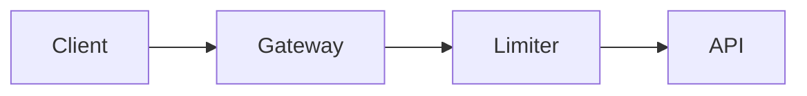

# Introduction

VisualPlan renders an AI agent's implementation and design plans as polished, visual web pages
instead of walls of text. A plan is written as MDX and compiled to a single self-contained HTML
page with architecture diagrams, charts, file-change trees, option comparisons, callouts, and a
numbered phase timeline.

It comes in two parts that work together:

- **`vplan`** is a CLI that renders a plan `.mdx` file to HTML.
- **`visual-plan`** is an agent skill that teaches any AI agent (Claude Code, Cursor, Codex, and
  others) the plan vocabulary, so it writes visual plans instead of prose.

## Why

A good plan is structural: phases, dependencies, file changes, tradeoffs. Terminal text flattens
all of that into prose that is slow to scan and easy to skim past. VisualPlan keeps the structure
visible, the agent writes a plan in a fixed, tiny component vocabulary and gets back a page a human
can actually read at a glance.

The output is a single file with everything inlined, no external assets, no server, no per-plan
toolchain. Open it locally, commit it, or hand it to a teammate.

## What a plan looks like

A plan is an MDX file that starts with a `# Title` (no frontmatter) and uses a fixed set of
components, always in scope (no imports):

````mdx
# Add rate limiting to the API

We add a sliding-window limiter at the gateway, behind a flag.



<Phase title="Build the limiter" status="active">
  Implement the Redis-backed window and return 429 over the limit.
</Phase>

<Callout type="risk">
  A Redis outage must fail open, not closed.
</Callout>
````

## Next steps

- [Installation](/docs/install/), set up the skill and the CLI.
- [Authoring plans](/docs/authoring/), the full component vocabulary.
- [CLI reference](/docs/cli/), every command and flag.
