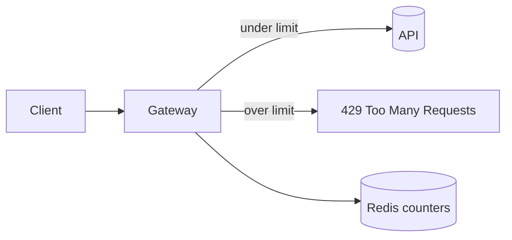

# Add rate limiting to the API

We are adding per-token rate limiting to the public API to protect upstream
services from bursty clients. The goal is a sliding-window limiter enforced at
the edge, observable, and safe to roll out behind a flag.

<Callout type='decision'>
  Limits are enforced in the gateway, not per-service, so a single client can't
  starve the fleet by spreading requests across endpoints.
</Callout>

## Architecture



## Approach

<Compare>
## Redis sliding window (pick)
- pro: accurate
- pro: shared across nodes
- con: network hop

## In-memory token bucket
- pro: fast
- pro: no deps
- con: per-node only
- con: lost on restart
</Compare>

<Matrix>
| Criterion           | Redis window (pick) | In-memory bucket |
|---------------------|---------------------|------------------|
| Accuracy            | exact               | approximate      |
| Shared across nodes | yes                 | no               |
| Added latency       | ~1ms                | none             |
| Ops burden          | a Redis dependency  | none             |
</Matrix>

<Questions>
- What is the limit per token: a fixed number, or per-plan tier?
- Should the limiter fail open or fail closed if Redis is unreachable?
- Do internal service-to-service calls get exempted from limiting?
</Questions>

<Phase title='Build the limiter' status='active'>
  1. Add a `RateLimiter` backed by Redis `INCR` + `EXPIRE`.
  2. Return `429` with a `Retry-After` header when the window is exceeded.

  <FileTree>
  - add src/gateway/rate-limiter.ts
  - modify src/gateway/middleware.ts
  - delete src/gateway/legacy-throttle.ts
  - delete src/gateway/legacy/
  </FileTree>

  ```ts title="src/gateway/rate-limiter.ts"
  // sliding-window check against Redis, returns false when over the limit
  async function allow(token: string): Promise<boolean> {
    const key = `rl:${token}`
    const count = await redis.incr(key)
    if (count === 1) await redis.expire(key, WINDOW_SECONDS)
    return count <= MAX_REQUESTS
  }
  ```
</Phase>

<Phase title='Roll out behind a flag' status='planned'>
  Ship dark, then ramp the flag from 1% to 100% while watching reject rates.

  <Chart type='bar' title='Estimated effort (days)'>
  - Limiter: 2
  - Flag + ramp: 1
  - Dashboards: 1
  </Chart>

  <Chart type='bar' title='Requests/s by ramp step'>
  | Step | Allowed | Rejected |
  |------|---------|----------|
  | 1%   | 50      | 2        |
  | 10%  | 480     | 15       |
  | 100% | 4800    | 120      |
  </Chart>
</Phase>

<Callout type='risk'>
  A Redis outage must fail open, not closed, or every request becomes a 429.
</Callout>

<Callout type='warn'>
  Returning `429` without a `Retry-After` header makes well-behaved clients retry
  immediately and amplify the load. Always set it.
</Callout>
