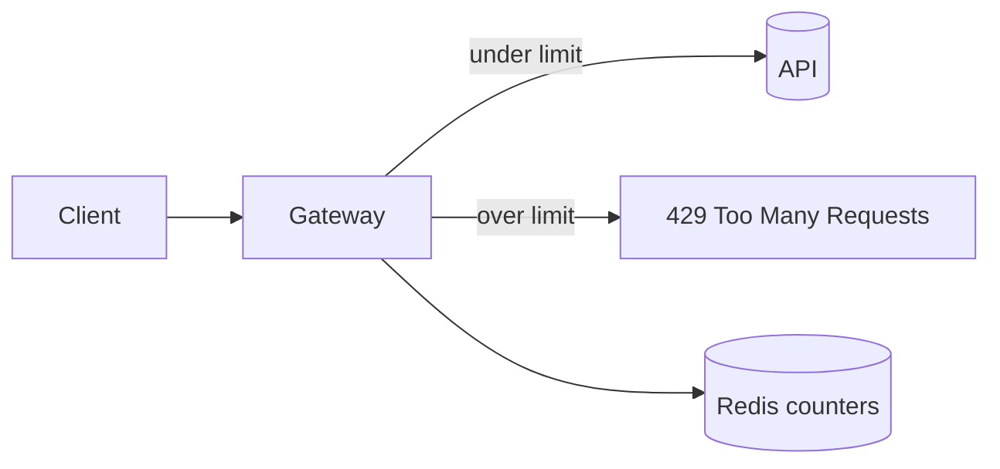

We are adding per-token rate limiting to the public API to protect upstream
services from bursty clients. The goal is a sliding-window limiter enforced at
the edge, observable, and safe to roll out behind a flag.

<Callout type='decision'>
  Limits are enforced in the gateway, not per-service, so a single client can't
  starve the fleet by spreading requests across endpoints.
</Callout>

## Architecture

## Approach

<Compare
  options={[
    { name: 'Redis sliding window', pros: ['accurate', 'shared across nodes'], cons: ['network hop'], pick: true },
    { name: 'In-memory token bucket', pros: ['fast', 'no deps'], cons: ['per-node only', 'lost on restart'] },
  ]}
/>

<Phase title='Build the limiter' status='active'>
  1. Add a `RateLimiter` backed by Redis `INCR` + `EXPIRE`.
  2. Return `429` with a `Retry-After` header when the window is exceeded.

  <FileTree
    files={[
      { path: 'src/gateway/rate-limiter.ts', change: 'add' },
      { path: 'src/gateway/middleware.ts', change: 'modify' },
      { path: 'src/gateway/legacy-throttle.ts', change: 'delete' },
    ]}
  />
</Phase>

<Phase title='Roll out behind a flag' status='planned'>
  Ship dark, then ramp the flag from 1% to 100% while watching reject rates.

  <Chart
    type='bar'
    title='Estimated effort (days)'
    data={[
      { label: 'Limiter', value: 2 },
      { label: 'Flag + ramp', value: 1 },
      { label: 'Dashboards', value: 1 },
    ]}
  />
</Phase>

<Callout type='risk'>
  A Redis outage must fail open, not closed, or every request becomes a 429.
</Callout>
